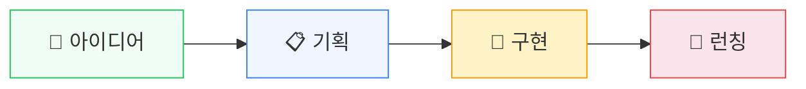

## 당신은 이미 시작했습니다

이 글을 읽고 있다는 건, 당신이 이미 무언가를 만들고 싶다는 뜻입니다.

아이디어는 있는데 손이 묶여있는 느낌. 개발자를 구해야 하는데 비용도, 시간도, 커뮤니케이션도 만만치 않은 현실. "내가 직접 만들 수 있으면 얼마나 좋을까?"

그 생각, 틀리지 않았습니다.

## 바이브코딩이라는 새로운 흐름

2025년, 안드레이 카파시가 "바이브코딩"이라는 말을 꺼냈습니다. AI에게 자연어로 지시하면 코드가 나오는 방식. "분위기(vibe)를 전달하면 코딩이 된다"는 뜻입니다.

그리고 불과 1년 만에, 이 단어는 콜린스 사전의 올해의 단어가 되었습니다.

지금 이 순간에도 Lovable, Bolt, Cursor 같은 도구로 비개발자들이 앱을 만들고 있습니다. Vercel의 데이터에 따르면, 바이브코딩 사용자 중 **63%가 비개발자**입니다.

<Callout type="info">
바이브코딩은 "AI가 알아서 코딩해주는 것"이 아닙니다. 정확히는, 당신이 구조적으로 지시하면 AI가 그것을 코드로 옮겨주는 방식입니다. 지시의 질이 결과의 질을 결정합니다.
</Callout>

## 그런데 왜 대부분은 실패할까요?

솔직하게 말하겠습니다. 바이브코딩 도구로 10분 만에 예쁜 화면을 만들 수 있습니다. 하지만 그 화면의 버튼을 누르면? 아무 일도 일어나지 않습니다.

왜냐하면 **프로덕트의 구조를 모르기 때문**입니다.

네비게이션 앱 사용법은 알지만, 지도 자체를 읽을 줄 모르는 것과 같습니다. 도구가 바뀌면 — 그리고 도구는 반드시 바뀝니다 — 다시 원점입니다.

<Callout type="warning">
도구의 사용법을 익히는 것과 프로덕트의 구조를 이해하는 것은 완전히 다릅니다. 전자는 도구가 바뀌면 무용지물이 되지만, 후자는 어떤 도구를 쓰든 유효합니다.
</Callout>

<SelfCheck question="당신이 지금 쓰는 AI 도구(Cursor, Lovable, Bolt 등)가 내일 없어진다면, 당신은 다른 도구로 같은 결과를 만들 수 있을까요?" hint="도구의 사용법을 아는 것과 '무엇을 만들어야 하는지'를 아는 것 중 어느 쪽이 더 오래 쓸모있을지 생각해보세요.">
이 질문의 핵심은 "도구 의존"과 "구조 이해"의 차이입니다. 특정 도구의 버튼 위치를 외우는 것은 도구가 바뀌면 사라집니다. 반면 "로그인이 어떤 원리로 작동하는지"를 알면, 어떤 도구에서든 AI에게 정확하게 지시할 수 있습니다. 이 가이드가 가르치는 것은 후자입니다.
</SelfCheck>

## 이 가이드가 다른 점

이 가이드는 "Cursor를 어떻게 쓰나요?"에 답하지 않습니다.

대신 이런 질문에 답합니다:
- 왜 프론트엔드와 백엔드로 나뉘어야 하나요?
- 데이터는 어디에 저장되고, 어떻게 이동하나요?
- 로그인은 어떤 원리로 작동하나요?

이걸 이해하면, 어떤 AI 도구를 쓰든 **정확한 지시**를 내릴 수 있습니다.

<Callout type="tip">
이 가이드는 지도 읽는 법을 가르칩니다. 특정 네비게이션 앱 사용법이 아니라, 지도 자체를 읽는 능력. 그것이 당신을 도구에 종속되지 않는 바이브코더로 만드는 차이입니다.
</Callout>

## 여정 미리보기

앞으로 16개 챕터에 걸쳐, 4단계 여정을 함께합니다.

<JourneyRoadmap />

1. **점화** — 지금 이 순간. 왜 이걸 알아야 하는지 이해합니다
2. **지도 그리기** — 프로덕트가 뭘로 만들어지는지 해부합니다
3. **직접 만들기** — 실제로 도구를 쥐고 첫 프로덕트를 만듭니다
4. **자유자재** — 독립적으로 판단하고 반복하는 바이브코더가 됩니다

<SelfCheck question="4단계 여정 중, 지금 당신이 가장 취약하다고 느끼는 단계는 어디인가요?" hint="'도구를 쥐고 만드는 것'과 '왜 이렇게 만드는지 이해하는 것' 중 어느 쪽이 더 부족한지 생각해보세요.">
대부분의 바이브코더는 3단계(직접 만들기)는 이미 해봤지만, 2단계(지도 그리기)를 건너뛰었기 때문에 막힙니다. 당신이 어느 단계에서 막히는지 파악하는 것 자체가 이 여정의 시작입니다.
</SelfCheck>

<KeyTakeaway>

- 바이브코딩은 코딩이 아니라 '구조적 지시'다
- 도구를 따라하는 것과 이해하는 것은 다르다
- 이 가이드는 지도 읽는 법을 가르친다

</KeyTakeaway>

준비되셨나요? 다음 챕터에서 만나겠습니다.

<ActionItem>
지금 당장, 당신이 만들고 싶은 앱이나 서비스를 하나 떠올려보세요. 이름은 없어도 됩니다. '이런 게 있으면 좋겠다'는 느낌이면 충분합니다.
</ActionItem>

<NextPreview>
그런데 왜 대부분의 비개발자가 만든 앱은 '빈 껍데기'일까요? 버튼은 있는데 누르면 아무 일도 안 일어나는 그것. Ch.1에서 그 이유를 파헤칩니다.
</NextPreview>
