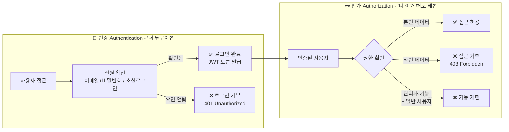
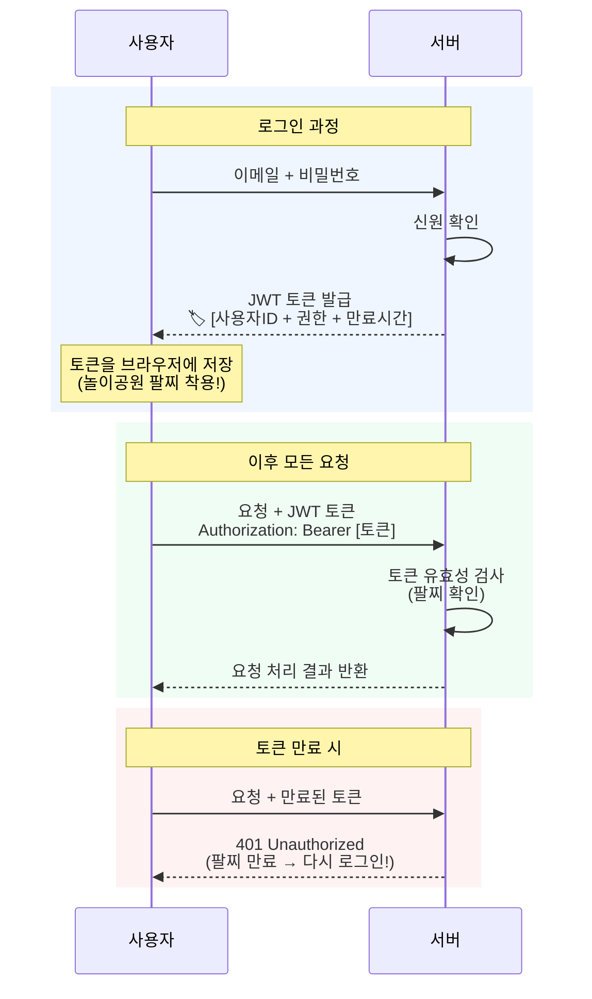

## "야, 너 메모가 나한테 다 보이는데?"

밤새워서 만들었습니다.

회원가입도 되고, 로그인도 됩니다. 프로필 사진도 올라가고, 메모도 저장됩니다. 뿌듯합니다. 친구한테 자랑하고 싶어서 링크를 보냈습니다.

친구가 가입합니다. 로그인합니다. 그리고 이렇게 말합니다.

"야, 너 메모가 나한테 다 보이는데?"

내 프로필, 내 메모, 내 데이터가 — 친구 화면에도 그대로 보입니다. 친구가 쓴 메모도 내 화면에 뜹니다. 심지어 친구가 내 프로필을 수정할 수도 있습니다. 로그인은 분명히 따로 했는데, 들어가면 모든 게 뒤섞여 있습니다.

"로그인은 되는데, 유저별로 다른 데이터를 보여주는 게 안 된다."

바이브코딩 커뮤니티에서 가장 많이 반복되는 질문입니다. 이 문제가 왜 생기는지, 어떤 구조가 빠져 있는 건지, 어떻게 해결하는 건지 — 지금부터 하나씩 풀어가겠습니다.

---

## 두 가지 질문 — 호텔 로비에서 생기는 일

이 문제를 이해하려면, 먼저 비슷해 보이지만 완전히 다른 두 가지 질문을 구분해야 합니다.

### "너 누구야?" — 인증(Authentication)

호텔에 도착했습니다. 프런트 데스크에서 신분증을 보여줍니다.

"예약하신 김OO님 맞으시죠?"

이게 **인증**입니다. 이 사람이 누구인지 확인하는 것. 웹에서는 이메일과 비밀번호로 로그인하거나, "카카오로 로그인" 버튼을 누르는 행위가 여기에 해당합니다.

넷플릭스를 켤 때 가장 먼저 하는 것도 이겁니다. 아이디와 비밀번호를 입력해서 "이 계정의 주인이 맞다"는 걸 확인합니다. 이게 인증입니다.

### "너 이거 해도 돼?" — 인가(Authorization)

신분증 확인이 끝나면 키카드를 받습니다. 이 키카드로 내 객실 1205호에는 들어갈 수 있지만, 옆방 1206호는 열 수 없습니다. 수영장은 이용 가능하지만, 비즈니스 라운지는 프리미엄 회원만 사용할 수 있습니다.

이게 **인가**입니다. 확인된 사람이 "무엇을 할 수 있고, 무엇을 볼 수 있는지" 결정하는 것.

넷플릭스에서 이걸 바로 볼 수 있습니다. 로그인한 다음 "누가 볼 건가요?" 화면에서 프로필을 고르죠. 같은 계정인데 프리미엄 요금제이면 4K 화질이 되고, 기본 요금제면 HD까지만 됩니다. "어린이" 프로필을 선택하면 성인 콘텐츠가 아예 안 보입니다. 같은 로그인인데 볼 수 있는 것이 다릅니다. 이게 인가입니다.

당근마켓에서도 마찬가지입니다. 내가 올린 중고 물건 글에는 "수정" 버튼이 보이는데, 다른 사람의 글에는 수정 버튼이 없습니다. 게시글의 작성자 ID가 로그인한 사용자의 ID와 일치하면 수정 버튼을 보여주고, 아니면 숨기는 겁니다. 이것도 인가입니다.

이 두 개념의 차이와 흐름을 한눈에 보면 이렇습니다:

### 핵심: 인증 없이 인가는 불가능합니다

누군지도 모르는데 뭘 할 수 있는지 정할 수 없으니까요. 호텔에서 신분증 확인(인증) 없이는 키카드(인가)를 받을 수 없습니다.

이제 도입부의 문제가 보이기 시작합니다. "친구한테 내 데이터가 다 보인다" — 이건 로그인(인증)까지는 했지만, "이 유저에게 어떤 데이터를 보여줄지"(인가)를 설정하지 않아서 생기는 겁니다.

<SelfCheck question="'로그인은 되는데, 유저별로 다른 데이터를 보여주는 게 안 된다' — 이 문제가 인증 문제일까요, 인가 문제일까요?" hint="로그인 자체는 되고 있다는 점에 주목하세요.">
인가(Authorization) 문제입니다. 인증(로그인)은 성공했지만, "이 사용자에게 어떤 데이터를 보여줄지" 규칙이 설정되지 않은 것입니다. Supabase의 RLS(Row Level Security)가 이 문제를 해결합니다.
</SelfCheck>

두 개가 다른 개념이라는 걸 모르면, 로그인만 되면 자동으로 유저별 데이터가 나눠질 거라고 기대합니다. 실제로는 그렇지 않습니다. 로그인은 "누구인지 확인"까지만이고, "이 사람에게 뭘 보여줄지"는 별도로 설정해줘야 합니다.

카카오톡 단톡방을 생각해보면 더 분명해집니다. 방장은 방 이름을 바꿀 수 있고 멤버를 내보낼 수 있지만, 일반 멤버는 메시지를 보내는 것만 가능합니다. 같은 단톡방인데 할 수 있는 행동이 다릅니다. 이걸 **역할 기반 인가(Role-Based Authorization)**라고 합니다. 내 서비스에서 "관리자와 일반 사용자의 권한을 다르게 하고 싶다"고 AI에게 말할 때, 바로 이 개념이 쓰입니다.

---

## 팔찌의 비밀 — 로그인 상태는 어떻게 유지되는가

한번 로그인하면 페이지를 옮겨 다녀도 계속 로그인 상태가 유지되죠? 이게 어떻게 가능한 걸까요?

**놀이공원 자유이용권 팔찌**를 생각해보세요.

놀이공원 입구에서 표를 보여주고 본인 확인을 합니다 — 이게 로그인입니다. 그러면 팔찌를 채워줍니다. 이제부터 놀이기구를 탈 때마다 매표소에 다시 가서 신분증을 보여줄 필요가 없습니다. 팔찌만 보여주면 됩니다. 각 놀이기구 직원은 이 사람이 누구인지 기억할 필요도 없습니다. 팔찌가 유효한지만 확인하면 되니까요.

이 팔찌가 바로 **토큰(Token)**입니다.

웹에서 가장 많이 쓰이는 토큰의 형식이 **JWT**(JSON Web Token)인데, 작동 방식은 정확히 팔찌와 같습니다. 로그인하면 서버가 "이 사람은 확인됐다"는 정보를 담은 토큰을 발급합니다. 이후 페이지를 이동하거나 데이터를 요청할 때마다, 이 토큰을 함께 보냅니다. 서버는 토큰이 유효한지 확인하고 요청을 처리합니다.

팔찌의 가장 중요한 특성 — **팔찌 자체에 정보가 들어 있다**는 겁니다. 놀이기구 직원이 본사에 전화해서 "이 사람 입장 맞아요?"를 확인할 필요가 없습니다. 팔찌 안에 "자유이용권, 유효기간 오후 6시까지"라는 정보가 이미 적혀 있으니까요. JWT도 토큰 안에 사용자 ID, 권한, 만료 시간이 모두 담겨 있어서 서버가 데이터베이스를 매번 조회하지 않아도 됩니다.

이 전체 흐름을 다이어그램으로 보면 더 명확합니다:

가끔 아무 이유 없이 웹사이트에서 갑자기 로그아웃되는 경험, 해보셨죠? 그게 바로 토큰(팔찌)이 만료된 겁니다. 자유이용권이 하루짜리면 다음 날 다시 표를 사야 하듯이, JWT도 만료 시간이 지나면 다시 로그인해야 합니다.

### 잠깐, 세션이라는 것도 있습니다

토큰과 다른 오래된 방식이 하나 있습니다. **세션(Session)** 방식입니다.

동네 단골 술집에서 "오늘 외상으로 주세요"라고 하면, 주인이 장부에 기록합니다. 다음에 주문할 때마다 주인이 장부를 확인합니다. 기록은 서버(주인의 장부)에 있고, 사용자가 갖고 있는 건 "3번 테이블 손님"이라는 번호표뿐이고요.

반면 JWT(팔찌) 방식은 장부가 필요 없습니다. 팔찌에 모든 정보가 담겨 있으니까요.

| | 세션 방식 (술집 장부) | JWT 토큰 방식 (놀이공원 팔찌) |
|---|---|---|
| 정보 저장 위치 | 서버 장부 | 토큰 자체 |
| 강제 로그아웃 | 쉬움 (장부에서 삭제) | 어려움 (토큰 만료까지 유효) |
| 확장성 | 서버 여러 대면 장부 공유 필요 | 어느 서버든 팔찌만 확인하면 됨 |

현대 웹 서비스, 특히 바이브코딩에서 많이 쓰는 Supabase, Clerk, Firebase는 대부분 JWT 토큰 방식을 씁니다. 확장성 때문입니다.

---

## 발레 키 — "카카오로 로그인"은 어떻게 되는 건가

요즘 대부분의 앱에서 "구글로 로그인", "카카오로 로그인" 버튼을 보셨을 겁니다. 이걸 **소셜 로그인**이라고 하고, 기술적으로는 **OAuth**라는 방식을 씁니다.

중요한 질문이 있습니다. 배달의민족에서 "카카오로 로그인"을 누르면, 내 카카오 비밀번호를 배달의민족에 알려주는 걸까요?

**아닙니다.** 절대 아닙니다.

이걸 이해하려면 **자동차 발레파킹 키**를 떠올려보세요.

호텔에서 발레파킹을 맡길 때, 차의 마스터 키를 직원에게 주진 않습니다. 마스터 키는 트렁크도 열고, 글로브 박스도 열고, 모든 것에 접근할 수 있으니까요. 대신 **발레 키**를 줍니다. 이 키로는 오직 운전과 주차만 가능합니다. 트렁크? 못 엽니다.

OAuth가 정확히 이 방식입니다. 사용자가 "카카오로 로그인"을 누르면, 카카오가 사용자에게 확인합니다 — "배달의민족이 당신의 이름, 이메일 정보를 요청합니다. 허용하시겠습니까?" 사용자가 허용하면, 카카오가 배달의민족에게 **제한된 정보에만 접근할 수 있는 임시 키**를 발급합니다. 이 과정에서 카카오 비밀번호는 배달의민족에 절대 전달되지 않습니다.

카카오 계정 하나로 멜론도 쓰고, 카카오뱅크도 쓰고, 카카오맵도 씁니다. 그런데 멜론이 내 은행 잔고를 볼 수 있을까요? 절대 아닙니다. 멜론에게 발급된 발레 키에는 "음악 서비스에 필요한 프로필 정보만 조회 가능"이라고 적혀 있습니다. 이 "허용 범위"를 기술 용어로 **스코프(Scope)**라고 합니다.

---

## 직접 만들면 위험한 이유

여기까지 읽으면 이런 생각이 들 수 있습니다. "로그인 기능? 이메일이랑 비밀번호 받아서 데이터베이스에 저장하면 되는 거 아니야?"

솔직히 말하면, **이것만큼 위험한 생각이 없습니다.**

<Callout type="warning">
비밀번호를 데이터베이스에 그대로 저장하는 건 — 식당으로 치면 손님의 신용카드 번호를 메뉴판 뒷면에 적어놓는 것과 같습니다. 해킹이라도 당하면 모든 고객의 정보가 한꺼번에 유출됩니다.
</Callout>

전문가들이 강력하게 권고하는 원칙이 있습니다: **인증은 직접 만들지 마라.**

바이브코딩으로 "로그인 만들어줘" 했을 때 빠지기 쉬운 함정들입니다:

| 실수 | 어떤 공격에 노출되는가 |
|---|---|
| **비밀번호를 그대로(평문) 저장** | DB 유출 시 전체 비밀번호 노출 → 다른 사이트 연쇄 해킹 |
| **로그인 시도 횟수 제한 없음** | 초당 수천 번 비밀번호 자동 시도 가능 |
| **MFA(다단계 인증) 미구현** | 비밀번호 하나 털리면 계정 즉시 탈취 |

이것 중 하나라도 빠지면 보안 사고가 납니다. 그리고 이게 전부 구현돼 있어도, 새로운 공격 방식이 매달 등장합니다.

### 왜 전문가도 직접 만들지 않는가

인증 시스템을 직접 구축하면 초기에만 전담 개발자 기준 3~6개월이 필요하고, 이후 보안 모니터링·취약점 패치·규정 준수 업데이트까지 포함하면 연간 수억 원에 달합니다. 거기다 유럽 사용자가 한 명이라도 있으면 **GDPR(유럽 개인정보보호법)** 적용을 받고, 한국 개인정보보호법에 따른 암호화 저장·유출 신고 의무도 있습니다.

전문 인증 서비스(Clerk, Supabase Auth 등)를 쓰면 초기에는 무료이고, 사용자가 5만 명 넘기 전까지 거의 비용이 없습니다. 이 서비스들은 이미 모든 보안 규제를 준수하고, 보안 팀이 24시간 새로운 위협을 모니터링합니다. 혼자서 이걸 관리하는 건 사실상 불가능합니다.

인증이 바로 "직접 만들지 않고 전문 서비스를 붙이는" 원칙의 대표적인 사례입니다.

<Callout type="tip">
AI에게 "로그인 만들어줘"라고 하면 대부분 직접 구현합니다. 대신 "Clerk으로 로그인 기능 추가해줘" 또는 "Supabase Auth로 이메일 로그인 설정해줘"라고 서비스 이름을 명시하세요. 결과의 질이 완전히 달라집니다.
</Callout>

---

## 어떤 인증 서비스를 붙일 것인가

2026년 기준, 바이브코더가 선택할 수 있는 인증 서비스는 네 가지입니다:

| 서비스 | 핵심 특징 | 언제 쓰면 좋은가 | 무료 범위 |
|---|---|---|---|
| **Clerk** | 로그인/가입 UI까지 완성품으로 제공. 붙이기 가장 쉬움 | 빠르게 만들고 싶을 때 | 50,000 MRU/월 |
| **Supabase Auth** | DB(Supabase)와 통합. RLS로 행 단위 보안 설정 가능 | 이미 Supabase를 쓰고 있을 때 | 50,000 MAU/월 |
| **Firebase Auth** | 구글이 운영. 모바일 앱에 강함 | 구글 서비스 연동 시. 모바일 앱 개발 시 | 50,000 MAU/월 |
| **NextAuth.js** | 오픈소스. 완전 무료 | 코딩 경험이 있을 때. 비용 최소화 시 | 제한 없음 (자체 서버) |

> **Clerk의 MRU vs MAU:** Clerk는 MAU(월간 활성 사용자) 대신 **MRU(Monthly Returning User — 월간 재방문 사용자)**를 기준으로 삼습니다. 신규 가입자는 무료 카운트에서 제외되기 때문에, 초기에는 실제 5만 명보다 더 많은 사용자를 무료로 수용할 수 있습니다.

규모가 커지면 비용이 크게 달라집니다. 10만 MAU 기준으로 Clerk은 월 약 250만 원, Supabase Auth는 약 26만 원, NextAuth.js는 서버 비용만 낼 수 있습니다. 지금 당장 실감이 안 돼도 처음 시작할 때 이 그림을 알고 있으면 나중에 서비스를 갈아엎는 일을 피할 수 있습니다.

### 상황별로 어떤 서비스를 고르면 좋은가

**"처음이고, 가장 쉬운 걸 원해"** → **Clerk**

로그인·회원가입·프로필 관리 화면을 이미 다 만들어놨습니다. AI에게 "Clerk으로 로그인 기능 추가해줘"라고만 말하면 됩니다.

**"이미 Supabase로 데이터베이스를 쓰고 있어"** → **Supabase Auth**

같은 플랫폼이라 연동이 자연스럽습니다. 특히 **RLS(Row Level Security)** — 데이터베이스의 각 행(row)마다 "누가 볼 수 있는지" 보안 규칙을 거는 것 — 을 데이터베이스 단에서 직접 걸 수 있습니다. 도입부의 "친구한테 내 데이터가 다 보이는" 문제, 이게 바로 RLS로 해결되는 겁니다.

**"모바일 앱을 만들고 있어"** → **Firebase Auth**

구글이 직접 운영하는 서비스라 안정성이 높고, Android 앱과의 통합이 뛰어납니다.

**"비용을 최소화하고 싶어"** 또는 **"Cursor로 만들고 있어"** → **NextAuth.js**

오픈소스이고 무료입니다. 단, UI를 직접 만들어야 하고 설정이 상대적으로 복잡합니다.

---

## 에러 코드가 말해주는 것

인증을 구현하다 보면 만나는 에러 두 가지가 있습니다. 챕터 3에서 배운 상태 코드, 기억하시죠?

**401 Unauthorized — "너 누군지 모르겠는데?"**

로그인이 안 됐거나, 토큰이 만료됐거나, 토큰을 아예 안 보낸 경우입니다. 팔찌를 안 차고 놀이기구를 타려는 상황. 가장 흔한 원인은 환경 변수 미설정입니다. 로컬에서는 잘 됐는데 배포 후 401이 뜨면, 배포 환경에 API 키를 넣지 않은 건 아닌지 먼저 확인하세요.

**403 Forbidden — "누군지는 알겠는데, 너한테는 이 권한이 없어."**

로그인은 됐지만, 이 데이터나 기능에 접근할 권한이 없는 경우입니다. 키카드는 있는데 비즈니스 라운지 출입 권한이 없는 상태. Supabase에서 RLS를 설정했는데 로그인 상태가 제대로 전달이 안 되면 403이 뜹니다.

**401은 인증 문제, 403은 인가 문제.** 이 구분만 알아도 네트워크 탭에서 에러를 봤을 때 "로그인/토큰 쪽을 봐야겠구나" 또는 "권한 설정 쪽을 봐야겠구나"라고 바로 방향을 잡을 수 있습니다.

---

<KeyTakeaway>
- 인증은 "누구인지 확인", 인가는 "뭘 할 수 있는지 확인" — 둘은 완전히 다르다
- 비밀번호는 단방향 암호화되어 저장된다 — 원본을 아는 사람은 아무도 없다
- 인증은 직접 만들지 말고 전문 서비스(Clerk, Supabase Auth 등)를 쓰라
- "유저별 데이터가 안 나뉜다"는 인가 문제다 — RLS로 해결한다
</KeyTakeaway>

## 졸업 테스트

이 챕터를 졸업하려면, 다음에 답할 수 있어야 합니다:

1. 인증(Authentication)과 인가(Authorization)의 차이를 한 문장으로 설명해보세요. "로그인은 되는데 유저별 데이터가 안 나뉜다"는 문제가 둘 중 어디와 관련된 건가요?

2. JWT 토큰을 놀이공원 팔찌에 비유해보세요. 왜 가끔 웹사이트에서 갑자기 로그아웃 되는 건가요?

3. "카카오로 로그인"을 누르면 내 카카오 비밀번호가 그 앱에 전달되나요? 발레파킹 키 비유로 설명해보세요.

4. 내 서비스에 로그인 기능이 필요하다면, Clerk / Supabase Auth / Firebase Auth / NextAuth.js 중 어떤 상황에서 어떤 걸 선택할지 말해보세요.

5. **지금 해보기:** 폰에서 가장 최근에 설치한 앱을 하나 열어보세요. "이 앱은 인증을 어떤 방식으로 하고 있지? (이메일/비밀번호? 소셜 로그인? 둘 다?)" — 그리고 로그인한 후, "내 데이터와 다른 사람의 데이터가 어떻게 분리되어 있지?"를 찾아보세요. 두 가지가 보이기 시작하면, 이 챕터를 졸업한 겁니다.

<ActionItem>
지금 쓰고 있는 서비스 3개의 로그인 방식을 확인해보세요. 이메일+비밀번호인지, 소셜 로그인(카카오/구글)인지, OTP(문자 인증)인지 분류해보세요. 그리고 각 서비스에서 "내 데이터와 다른 사람의 데이터가 어떻게 분리되어 있는지" 관찰해보세요.
</ActionItem>

---

## 더 알아보기

- **10만 MAU 기준 서비스별 비용 비교:** Clerk ~$1,800/월, Firebase Auth ~$275/월, Supabase Auth ~$188/월, NextAuth.js 서버 비용만
- **Clerk 5단계 프롬프트:** AI에게 Clerk을 단계별로 붙이는 구체적 지시 방법 → Ch.10 "인증 서비스 붙이기 프롬프트" 참조
- **알고 나면 달라지는 프롬프트:** "로그인 만들어줘"와 "Supabase Auth + RLS 설정해줘"의 차이 → Ch.10 참조

---

## 다음으로

이 챕터에서 인증 서비스를 "붙이는" 선택을 했습니다. Clerk, Supabase Auth, Firebase Auth, NextAuth.js — 이것들은 전부 누군가가 이미 만들어놓은 서비스를 가져다 연결한 겁니다. 직접 만들지 않고요.

근데 인증만 그런 게 아닙니다. 결제를 붙이려면? 이메일을 보내려면? 파일을 저장하려면? 지도를 넣으려면? — 이것들도 전부 이미 만들어진 외부 서비스를 가져다 쓰는 겁니다. 그리고 외부 서비스를 연결할 때는 반드시 "열쇠(API Key)"가 필요합니다. 이 챕터에서도 잠깐 나왔죠, 환경 변수 얘기.

이 열쇠를 잘못 다루면 어떤 일이 생기는지 — 다음 챕터에서 그 이야기를 제대로 합니다.

<NextPreview>
인증으로 "누구인지"를 알게 되었습니다. 그런데 현대 프로덕트는 결제, 이메일, 지도, AI 같은 외부 서비스를 연결해야 합니다. Ch.5에서 레고 블록 조합의 세계로 들어갑니다.
</NextPreview>

---

*호텔 키카드, 놀이공원 팔찌, 발레파킹 키. 세 가지 비유가 인증 시스템의 핵심 구조를 담고 있습니다. 다음에 어떤 앱이든 로그인할 때, "지금 인증이 일어나고 있구나. 토큰이 발급됐겠지. 그리고 내 프로필에 들어가면 인가가 작동해서 내 데이터만 보여주는 거구나" — 이런 생각이 자동으로 떠오르기 시작할 겁니다. 그게 구조를 이해한 사람의 눈입니다.*
