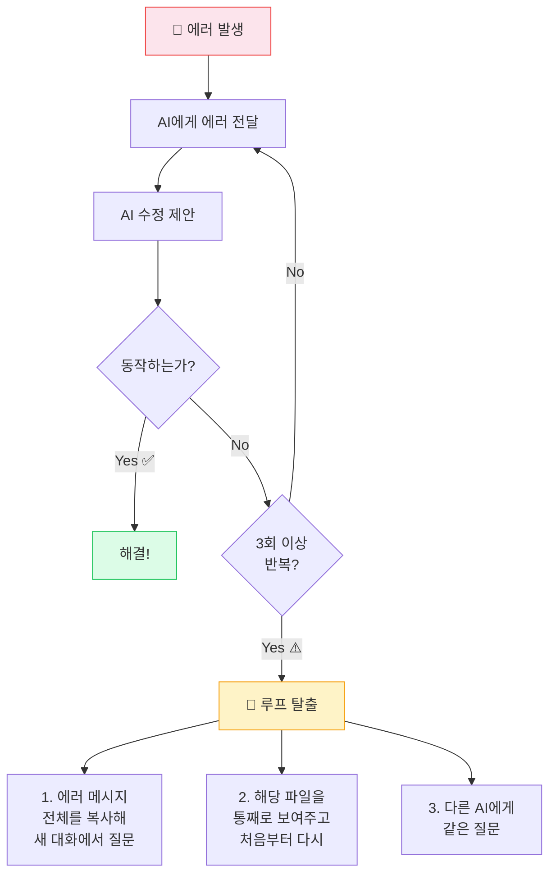

## 같은 AI, 다른 결과

두 사람이 똑같이 Cursor를 켰습니다.

<TwoColumn leftTitle="A씨의 접근" rightTitle="B씨의 접근" leftType="negative" rightType="positive">
<Left>

**지시:** "투두 앱 만들어줘."

AI는 열심히 일합니다. 예쁜 화면이 나왔습니다. 근데 새로고침하면 할일이 다 사라집니다. DB가 없으니까요. A씨는 "왜 사라져?"라고 다시 묻고, AI는 또 코드를 수정하고, 그러다 스타일이 깨지고, 고치다 다른 기능이 망가집니다.

</Left>
<Right>

**지시:** "Next.js App Router와 Supabase를 쓰는 투두 앱을 만들 거야. 먼저 1단계로, 할일을 추가하고 완료 표시하는 기본 UI 컴포넌트만 만들어줘. Supabase 연결과 DB는 아직 하지 마."

AI는 딱 UI만 만들었습니다. B씨가 확인합니다. "좋아, 이제 2단계: Supabase 테이블 만들고 연결해줘." 차례대로, 단계별로.

</Right>
</TwoColumn>

같은 도구, 같은 AI 모델. 결과는 완전히 다릅니다.

이 챕터는 그 차이가 어디서 오는지에 대한 이야기입니다.

그리고 이 챕터를 다 읽으면, 핵심이 세 가지로 정리됩니다.
---

## 이 챕터의 핵심 3가지

복잡하게 설명하기 전에, 먼저 결론을 드립니다.

<Callout type="tip">

- **① 기획 세션과 코딩 세션을 분리한다**
- **② 좋은 프롬프트는 맥락 + 범위 + 제약 + 순서다**
- **③ 에러는 상황 + 에러 메시지 + 제동으로 전달한다**

</Callout>

이 세 가지가 전부입니다. 나머지는 이 셋을 실행하는 방법입니다.

---

## 1. 기획과 코딩을 분리하라

AI 고수들이 가장 먼저 배우는 원칙입니다.

비개발자가 AI 코딩에서 실패하는 이유 1위는 AI가 부족해서가 아닙니다. 진짜 이유는 이겁니다:

> **"AI에게 기획과 코딩을 동시에, 계획 없이 시켰기 때문이다."**

**기획 세션** — AI와 함께 "무엇을 만들지" 결정합니다. Ch.6에서 PRD를 작성했다면, 그게 바로 기획 세션의 결과물입니다. 코드는 한 줄도 안 짭니다.

**코딩 세션** — 기획이 끝났으면, AI에게 "어떻게 만들지" 실행을 맡깁니다. 기획 결과를 들고 AI에게 가는 것에서 시작합니다.

이 두 가지를 섞으면 — 코딩하다가 기획도 바꾸고, 기획 바꾸다가 또 코딩하고 — AI는 점점 혼란스러워지고, 코드는 누더기가 됩니다. 다들 여기서 막힙니다.

<Callout type="info">
"생각(Thinking)과 타이핑(Typing)을 분리하라. AI에게 복잡한 문제 해결을 맡기는 것이 아니라, 인간이 깊이 고민하여 내린 결정을 AI가 코드로 구현하도록 하라."

— Josh Brake, "The Missing Prompts"
</Callout>

---

## 2. 좋은 프롬프트는 네 가지가 담겨 있다

이제부터는 AI가 아니라 당신이 대화를 지휘합니다.

좋은 프롬프트와 나쁜 프롬프트의 차이는 딱 하나입니다. **맥락의 양과 구조**입니다.

<BeforeAfterCompare beforeLabel="🚫 모호한 프롬프트" afterLabel="✅ 구체적 프롬프트">
<Before>

**초기 구축:** "인스타그램 같은 이미지 공유 앱 만들어줘."

**기능 추가:** "여기에 구글 로그인 기능 붙여줘."

**디버깅:** "(에러 코드 복붙) 이거 안 돼. 빨리 고쳐."

**디자인 수정:** "UI를 좀 더 예쁘고 세련되게 바꿔줘."

**리팩토링:** "코드가 너무 긴데 좀 짧고 빠르게 정리해 봐."

</Before>
<After>

**초기 구축:** "이미지 공유 앱을 만들 거야. Phase 1으로 Supabase를 이용해 '사용자'와 '게시물'의 데이터베이스 스키마(SQL)만 먼저 짜줘. 프론트엔드 코드는 아직 작성하지 마."

**기능 추가:** "현재 Next.js 코드베이스에 Supabase Auth를 이용한 구글 로그인 기능을 추가해 줘. 로그인 실패 시 사용자에게 보여줄 에러 메시지 알림(Toast) 로직도 포함해."

**디버깅:** "/src/cart.js에서 장바구니 총액이 업데이트되지 않고 있어. 어디서 상태가 누락되었는지 원인을 먼저 설명하고, 고칠 코드의 플랜을 제시해."

**디자인 수정:** "대시보드 UI를 Tailwind CSS를 사용해 수정해 줘. 메인 컬러는 blue-600으로, 모든 카드에 rounded-lg를 적용해. 모바일 화면에서도 깨지지 않게 반응형으로."

**리팩토링:** "App.jsx의 데이터 불러오기 로직을 최적화해 줘. 단, 기존 UI 컴포넌트와 주석은 삭제하지 말고, 변경 후에도 기존 기능들이 100% 동일하게 동작해야 해."

</After>
</BeforeAfterCompare>

패턴이 보입니다. 좋은 프롬프트에는 공통점이 있습니다.

**좋은 프롬프트 4요소:**
1. **맥락** — 기술 스택 명시 ("Next.js", "Supabase", "Tailwind CSS")
2. **범위** — "이것만", "아직 하지 마", "프론트엔드 코드는 제외"
3. **제약** — "기존 기능은 건드리지 마", "100% 동일하게 동작해야 해"
4. **순서** — "Phase 1", "먼저", "원인부터 설명하고"

<PromptFormula />

나쁜 프롬프트가 나쁜 이유는 모호해서가 아닙니다. **AI가 너무 많은 것을 혼자 결정해야 해서**입니다. AI는 모른다고 묻지 않습니다. 스스로 가정을 세우고 달려갑니다. 엉뚱한 방향으로.

### 한 번에 하나씩 쪼개라

비개발자가 AI에게 일을 맡길 때 가장 많이 저지르는 실수가 한 번에 너무 많이 요청하는 것입니다.

"회원가입 기능 만들어줘"는 사실 다섯 가지 일의 묶음입니다. UI 만들기, 유효성 검사, DB 저장, 중복 체크, 리다이렉트. 이걸 한 번에 요청하면 AI는 한 번에 다 만들려고 하고, 중간에 뭔가 잘못되면 어디서 잘못됐는지 찾기가 어려워집니다.

대신 "UI 먼저 → 확인 → 유효성 검사 추가 → 확인 → DB 연결"처럼 단계별로 쪼개세요. 각 단계에서 확인하고, 문제가 생기면 바로 잡을 수 있습니다.

---

## 3. 프로젝트 설명서: CLAUDE.md

매 대화마다 "이 프로젝트는 Next.js를 써, Supabase를 써"라고 반복하는 건 비효율적입니다. 더 큰 문제는, AI가 까먹습니다. 새 대화를 시작할 때마다 이전의 모든 것을 잊습니다. **기억상실증을 앓는 천재**입니다.

이를 해결하는 방법이 프로젝트 설명서 파일입니다.

<Callout type="info">
도구별 프로젝트 설명서 파일 위치:

- Claude Code → `CLAUDE.md`
- Cursor → `.cursor/rules/` 폴더 안의 파일
- Windsurf → Windsurf Rules
</Callout>

AI가 대화를 시작할 때마다 자동으로 읽는 "사내 매뉴얼"입니다. 새 직원에게 매번 회사 규칙을 설명하는 대신, 입사 첫날 매뉴얼 한 권을 주는 것처럼요.

**바로 쓸 수 있는 기본 템플릿:**

```
# Project: [내 프로젝트 이름]

[프로젝트 한 줄 설명: 예 — 1인 스터디 모임 매칭 서비스]

## Tech Stack (기술 스택)
- Frontend: Next.js App Router + shadcn/ui + Tailwind CSS
- Backend/DB: Supabase (Postgres, Auth, Storage)
- 배포: Vercel

## Rules (지켜야 할 규칙)
- 모든 데이터 접근은 Supabase 클라이언트를 통해 처리
- 인증은 Supabase Auth 사용 (직접 구현 금지)
- 스타일은 Tailwind CSS만 사용
- 새 패키지 추가가 필요하면 먼저 나에게 물어볼 것
```

한 가지만 기억하세요. **짧을수록 좋습니다.** 300줄이 넘어가면 AI가 오히려 헷갈립니다. 모든 작업에 보편적으로 적용되는 핵심 규칙만 넣으세요.

<Callout type="tip">
**지금 해보세요:** 지금 작업 중인 프로젝트(없다면 상상 프로젝트)의 맥락 파일을 3줄만 적어보세요. "이 프로젝트는 ___이다. 기술 스택은 ___이다. 코딩 규칙은 ___이다." 이 3줄이 AI의 응답 품질을 완전히 바꿉니다.
</Callout>

대화가 길어져서 AI가 앞 내용을 잊는 것 같다면 — 이건 누구나 겪는 일입니다 — 대화를 리셋하면 됩니다. "지금까지 완료한 기능과 해결한 버그를 요약해줘"라고 한 뒤, 새 대화에서 그 요약을 첫 메시지로 붙여넣으면 맥락이 이어집니다.

---

## 4. 에러가 났을 때: 관리자가 되라

에러는 반드시 납니다. 바이브코딩의 특성상 아무리 잘 짜도 에러는 납니다. 중요한 건 에러 자체가 아닙니다. **어떻게 AI에게 전달하느냐**가 결과를 가릅니다.

여기서도 다들 같은 실수를 합니다. "(에러 코드 복붙) 이거 에러 나. 당장 고쳐." — 이게 가장 나쁜 에러 리포트입니다.

### 에러 리포트 3요소

**1. 상황** — 무엇을 하려다 에러가 났는지
**2. 에러** — 브라우저 콘솔이나 터미널의 에러 메시지 그대로 (요약하거나 바꾸지 마세요)
**3. 제동** — 코드를 바로 수정하지 말고, 원인 분석을 먼저 받기

✅ **좋은 에러 리포트 예시:**

> **1. 상황:** 로그인 페이지(/src/login.js)에서 테스트 계정으로 로그인을 시도했어.
>
> **2. 에러:** 버튼을 누르면 화면이 넘어가지 않고, 콘솔에 이 에러가 떠:
> `TypeError: Cannot read properties of undefined (reading 'user')`
>
> **3. 제동:** 코드를 바로 수정하지 말고, 어느 부분에서 데이터가 누락되었는지 원인을 3줄 이내로 먼저 설명해. 그리고 어떻게 고칠 건지 계획을 말해주면 내가 승인할게.

"제동 걸기"가 핵심입니다. AI에게 코드 수정 권한을 주기 전에, 원인 분석과 계획을 먼저 받는 것입니다. 비개발자는 코드를 직접 고칠 필요가 없습니다. 하지만 AI가 "어떻게 고칠 것인지" 보고받고 **결재를 내리는 관리자 역할**은 반드시 수행해야 합니다.

<SelfCheck question="에러가 났을 때 '(에러 코드 복붙) 이거 에러 나. 당장 고쳐.'라고 하면 왜 안 좋은 에러 리포트인가요?" hint="AI가 코드를 고치기 전에 어떤 정보가 필요한지 생각해보세요.">
상황 정보가 없어서 AI가 어떤 동작 중에 오류가 났는지 모르고, 제동이 없어서 AI가 원인 분석 없이 즉시 코드를 수정하려 달려듭니다. 이렇게 하면 엉뚱한 부분을 수정하거나, 고치다가 다른 기능이 망가질 수 있습니다. 좋은 에러 리포트는 상황 + 에러 메시지 원문 + "분석 먼저, 수정은 승인 후" 제동의 3요소를 갖춰야 합니다.
</SelfCheck>

### AI가 같은 에러를 반복할 때

하나를 고치면 다른 게 망가지고, AI가 비슷한 코드를 계속 제안하는데 여전히 안 된다면 — AI 픽스 루프에 빠진 겁니다.

빠져나오는 법은 단순합니다.

**1단계: 즉시 멈추기** — "고쳐줘" 요청을 계속하는 것을 멈춥니다.

**2단계: 모드 전환** — "코드 수정은 잠깐 멈춰. 지금까지 시도한 해결책들이 왜 실패했는지, 근본 원인이 뭔지 분석만 해줘. 고치지 말고 설명만."

**3단계: 새 대화로 리셋** — 현재 대화가 오래됐을 수 있습니다. "지금까지 상황 요약해줘"라고 한 뒤, 새 대화를 열고 그 요약으로 재시작합니다.



<Callout type="warning">
AI 픽스 루프에서 "고쳐줘"를 계속 요청하는 것은 역효과입니다. 루프를 끊으려면 AI에게 코드를 고치게 두지 말고, 먼저 원인 분석과 증거(로그)를 가져오게 강제해야 합니다. — Reddit r/cursor 경험담
</Callout>

---

## 5. 개념을 알면 프롬프트가 달라진다

Ch.4에서 인증을 다뤘습니다. 그 챕터를 읽기 전과 읽은 후의 프롬프트를 비교해보면:

**인증 개념을 몰랐을 때:**
> "로그인 기능 만들어줘."

**인증과 인가를 이해한 후:**
> "Supabase Auth를 사용해서 이메일/비밀번호 로그인과 카카오 소셜 로그인을 구현해줘. 로그인 후에는 현재 유저의 ID를 기반으로 데이터를 필터링해서, 본인이 작성한 글만 보이도록 해줘. RLS도 설정해서 다른 유저의 데이터에 접근할 수 없게 해줘."

이 두 프롬프트 사이의 차이는 영어 실력이나 프롬프트 기술이 아닙니다. **구조에 대한 이해**입니다.

이게 이 가이드 전체를 관통하는 핵심 메시지입니다. **개념을 알면 프롬프트가 달라집니다. 프롬프트가 달라지면 결과물이 달라집니다.**

<SelfCheck question="'결제 기능 넣어줘'를 좋은 프롬프트 4요소(맥락/범위/제약/순서)를 갖춰 다시 작성해보세요." hint="현재 기술 스택은 무엇인지, 어느 단계까지만 할 건지, 기존 기능은 건드리면 안 되는지, 어떤 순서로 진행할 건지를 포함해보세요.">
예시: "현재 Next.js + Supabase를 사용하는 쇼핑몰 프로젝트에 결제 기능을 추가할 거야. 1단계로 Stripe 결제 버튼 UI만 먼저 만들어줘. 실제 결제 연동은 아직 하지 마. 기존 장바구니 기능의 코드는 수정하지 말고, 결제 페이지(/checkout)만 새로 추가해."
</SelfCheck>

---

## 실전 요약: 세 가지 상황별 체크리스트

### 새 기능을 만들 때

```
① 기획 세션에서 PRD로 무엇을 만들지 결정한다
② CLAUDE.md에 기술 스택과 규칙이 있는지 확인한다
③ 기능을 작은 단계로 쪼갠다
④ 각 단계마다: 기술 스택 + 범위 + 제약 + 순서를 담아 지시
⑤ 결과 확인 → 다음 단계
```

### 에러가 났을 때

```
① 에러 메시지를 그대로 복사한다
② 상황 + 에러 + 제동 3단계 포맷으로 전달한다
③ AI의 원인 분석을 읽는다 — 납득이 가는가?
④ 납득이 가면 수정을 승인한다
⑤ 납득이 안 가면 방향을 수정한다
```

### AI 루프에 빠졌을 때

```
① 즉시 멈춘다
② "분석만 해줘, 수정하지 마" 모드로 전환
③ 새 대화로 리셋 + 요약으로 재시작
```

<KeyTakeaway>

- 기획과 코딩은 분리하라 — AI에게 한 번에 다 시키지 마라
- 좋은 프롬프트의 4요소: 맥락, 구체적 지시, 제약 조건, 기대 결과
- 에러 리포트 3요소: 무엇을 했고, 무엇이 나왔고, 무엇을 기대했는지

</KeyTakeaway>

---

<ProgressChecklist chapterId="ch10">
  <CheckItem>기획 세션과 코딩 세션을 분리하는 것의 구체적 의미를 설명할 수 있다. 각 세션에서 AI에게 무엇을 시키고 무엇을 시키지 않는지도 말할 수 있다</CheckItem>
  <CheckItem>나쁜 프롬프트("결제 기능 넣어줘")를 맥락, 범위, 제약, 순서 4요소를 갖춰 좋은 프롬프트로 바꿀 수 있다</CheckItem>
  <CheckItem>AI 픽스 루프에서 빠져나오는 첫 번째 행동이 무엇인지, 왜 "고쳐줘"를 계속 요청하면 역효과인지 설명할 수 있다</CheckItem>
  <CheckItem>CLAUDE.md에 반드시 들어가야 할 내용 3가지를 말할 수 있다. 300줄이 넘으면 안 되는 이유도 설명할 수 있다</CheckItem>
  <CheckItem action>지금 진행 중인 프로젝트(또는 만들고 싶은 프로젝트)의 CLAUDE.md를 작성해봤다. 기술 스택, 규칙 2~3개, 폴더 구조 힌트를 담았다</CheckItem>
</ProgressChecklist>

<ActionItem>
지금 AI에게 시키고 있는 작업이 있다면, 좋은 프롬프트 4요소(맥락/지시/제약/기대)를 갖추고 있는지 점검해보세요.
</ActionItem>

---

## 다음으로

도구를 골랐고(Ch.9), AI와 대화하는 법도 익혔습니다(Ch.10).

그런데 여기서 비개발자가 가장 많이 빠지는 함정이 하나 더 있습니다.

"일단 돌아가니까 됐다" — 그리고 어느 날 갑자기, 하나를 고치면 다른 것이 망가지기 시작합니다. 새 기능을 추가하는 게 점점 느려집니다. AI도 점점 이상한 코드를 냅니다. 처음부터 다시 만들어야 할 것 같은 느낌.

이것을 **기술 부채(Technical Debt)**라고 합니다. 바이브코딩에서 특히 빠르게 쌓이는 이 함정을 피하는 법이 Ch.11의 주제입니다.

📎 **더 읽기:** [The Missing Prompts — Josh Brake](https://joshbrake.substack.com/p/the-missing-prompts) — 기획 세션과 코딩 세션 분리의 실무 사례

📎 **더 읽기:** [Writing a good CLAUDE.md — HumanLayer Blog](https://www.humanlayer.dev/blog/writing-a-good-claude-md) — CLAUDE.md 작성 원칙과 함정

📎 **더 읽기:** [Tips to Avoid Falling Into an AI Fix Loop — byldd.com](https://byldd.com/tips-to-avoid-ai-fix-loop/) — AI 루프 탈출 전략 전문

<NextPreview>
AI와 대화하는 법을 익혔습니다. 하지만 빠르게 만들수록 빠르게 쌓이는 것이 있습니다. Ch.11에서 바이브코딩의 가장 큰 함정, 기술 부채를 다룹니다.
</NextPreview>
