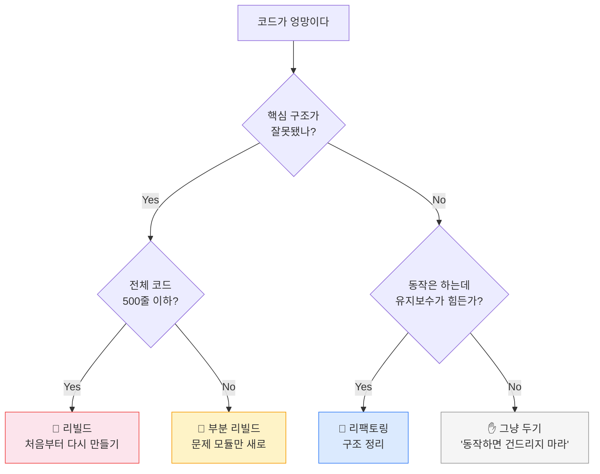

3개월 전, 이 사람은 무척 신났습니다.

기능 하나를 말하면 10분 안에 돌아가는 코드가 나왔습니다. 로그인 기능, 결제 연동, 알림 시스템. 쌓이는 게 눈에 보였습니다. "이 속도라면 두 달이면 출시하겠다"고 생각했습니다.

2개월 전, 속도가 조금 느려졌습니다.

알림 기능을 고쳤더니 결제 쪽에서 오류가 났습니다. 결제를 고쳤더니 로그인이 이상해졌습니다. AI에게 물어보면 고쳐줬지만, 다음 날 또 다른 곳이 고장났습니다. "좀 복잡해지긴 했는데 괜찮아"라고 스스로를 달랬습니다.

1개월 전, 새 기능 하나를 추가하는 데 나흘이 걸렸습니다.

원래라면 반나절이면 됐을 기능이었습니다. AI가 코드를 써줬는데 다른 부분이 깨졌습니다. 그걸 고쳤더니 또 다른 부분이 깨졌습니다. 두더지 게임처럼 계속 튀어나왔습니다.

이번 주, 이 사람은 조용히 프로젝트를 접었습니다.

---

이 이야기는 지어낸 것이 아닙니다. 레딧과 인디해커스에 수십 개의 게시물이 거의 동일한 패턴으로 올라와 있습니다. 바이브코딩으로 시작해서, 빠르게 만들다가, 어느 순간부터 고통이 시작되고, 결국 포기합니다.

이 챕터는 그 패턴의 이름을 알려주고, 왜 생기는지 설명하고, 어떻게 피하는지 알려줍니다.

이걸 읽고 나면, 여러분은 이미 대부분의 바이브코더보다 앞서 있습니다.

---

## 이 챕터의 핵심 프레임 2가지

이 챕터는 딱 두 가지를 위한 챕터입니다.

**① 5가지 신호** — 코드를 못 읽어도 내 프로젝트가 망가지고 있는지 감지하는 방법
**② 3가지 질문** — 코딩을 시작하기 전에 먼저 답해야 하는 것들, 기술 부채를 원천 차단하는 방법

나머지는 이 두 가지를 이해하기 위한 맥락입니다.

---

## 1. 기술 부채란 무엇인가

**기술 부채(Technical Debt)**란 "빠르게 대충 만든 대가로 나중에 갚아야 할 문제들"입니다.

식당으로 비유하면 이렇습니다. 오픈 첫날 손님이 몰려서 설거지가 밀렸습니다. 일단 싱크대 옆에 쌓아두고 내일 처리하기로 했습니다. 다음 날도 바빠서 또 쌓았습니다. 일주일 후, 주방의 30%가 더러운 그릇으로 꽉 찼습니다. 새 메뉴를 추가하려면 먼저 그릇부터 치워야 합니다. 그런데 치우는 것도 일입니다.

빚과 정확히 같은 구조입니다. **처음엔 편합니다. 나중에 이자가 붙어 돌아옵니다.**

기술 부채는 복리로 쌓입니다. 처음에는 작은 지름길 하나입니다. 그 지름길 위에 또 지름길이 생깁니다. 그 위에 또 하나. 어느 순간 전체 구조가 임시방편들의 탑이 됩니다. 이 상태에서 새 기능을 추가하려면 탑 전체가 흔들립니다.

하나를 고치면 다른 두 개가 망가지는 현상, 이걸 업계에서는 **두더지 게임(Whack-a-mole)**이라고 부릅니다.

기술 부채 자체는 나쁜 게 아닙니다. 숙련된 개발팀도 의도적으로 기술 부채를 씁니다. "지금은 빠르게 출시하고, 나중에 제대로 고치자"는 의식적인 결정이죠. 그리고 그 계획대로 실제로 갚습니다.

<Callout type="info">
기술 부채에는 두 종류가 있습니다. **의도적인 기술 부채**는 "빠른 출시 후 나중에 개선"이라는 명확한 계획이 있습니다. **무의식적인 기술 부채**는 빚이 있는지도 모른 채 쌓입니다. 바이브코딩에서 문제가 되는 것은 거의 항상 후자입니다.
</Callout>

**문제는 무의식적으로 쌓이는 기술 부채입니다.** 빚이 있는 줄도 모르고 계속 빌리는 것. 갚을 계획이 없는 것. 바이브코딩에서 일어나는 기술 부채는 거의 항상 이쪽입니다.

---

## 2. 왜 바이브코딩에서 특히 빠르게 쌓이는가

바이브코딩이라는 단어를 처음 만든 안드레이 카르파시(Andrej Karpathy)가 2025년 2월에 직접 이렇게 인정했습니다. "코드가 내 이해 범위를 넘어섰고, 버리는 주말 프로젝트에만 적합하다"고.

바이브코딩을 명명한 사람이 직접 한계를 선언한 겁니다.

아이러니는 여기서 끝나지 않습니다. 카르파시 본인이 이후 Nanochat이라는 채팅 앱을 AI 에이전트로 만들려다 결국 대부분의 코드를 직접 손으로 짰습니다. 구조적 한계를 실전에서도 피하지 못했습니다. 도구를 만든 사람도 그랬다면, 우리가 그 한계에 부딪히는 건 당연한 일입니다.

이게 내 얘기처럼 느껴진다면, 이미 신호가 온 겁니다.

### AI는 기억상실증 천재입니다

왜 이런 일이 생길까요?

AI에게 코드를 부탁할 때마다, AI는 매번 처음 출근하는 것처럼 일합니다. 뛰어난 능력을 가졌지만, 시니어 개발자의 코드 리뷰 없이 혼자 작업하는 상황처럼 전체 맥락을 모른 채 움직입니다. 여러분의 시스템 전체가 어떻게 돌아가는지, 지난주에 어떤 결정을 했는지, 왜 이 부분을 이렇게 만들었는지 모릅니다.

AI는 지금 대화창에 보이는 것만 압니다. 세 달 전에 만든 로그인 시스템의 설계 의도를, 두 달 전에 결제 모듈을 연결할 때 했던 타협을, 지난달에 알림 기능을 추가하면서 생긴 암묵적인 규칙을 모릅니다.

그래서 AI가 새 코드를 쓸 때, 기존 코드와 충돌할 수 있다는 걸 모른 채로 씁니다. 그 충돌이 쌓이는 것이 기술 부채입니다.

숙련된 개발자는 시스템 전체를 머릿속에 지도로 가지고 있습니다. 새 기능을 추가할 때 "이건 여기 연결하면 저기가 영향받겠다"를 미리 계산합니다. AI는 그 지도가 없습니다.

더 솔직하게 말하면, 여러분도 그 지도가 없습니다. 코드를 직접 쓰지 않았으니까요. 그래서 AI와 여러분이 함께 만드는 시스템은 지도 없이 짓는 건물입니다. 빠르게 올라가지만, 어느 순간 흔들립니다.

---

## 3. 코드를 못 읽어도 감지할 수 있는 5가지 신호

좋은 소식이 있습니다. 기술 부채는 코드를 못 읽어도 외부에서 감지할 수 있습니다. 자동차 엔진을 몰라도 "뭔가 이상한 소리가 난다"고 알아차리는 것처럼요.

**신호 1. 간단한 기능 추가가 점점 오래 걸린다**

처음에는 기능 하나 추가하는 데 2시간이면 됐습니다. 지금은 비슷한 복잡도의 기능을 추가하는 데 이틀이 걸립니다. 이 속도 저하는 우연이 아닙니다. 시스템이 복잡해져서, 모든 변경이 이전보다 많은 곳에 영향을 미치기 때문입니다.

**신호 2. 하나를 고치면 다른 게 고장난다**

두더지 게임이 시작됐습니다. 이 패턴이 일주일에 두 번 이상 반복된다면, 코드의 여러 부분이 예상하지 못한 방식으로 서로 얽혀 있다는 뜻입니다. 구조적인 문제입니다.

**신호 3. 버그 발생 빈도가 늘고 있다**

새 기능을 추가하지 않았는데도 기존 기능에서 새로운 버그가 나옵니다. 또는 고쳤던 버그가 다시 돌아옵니다. 기술 부채가 쌓일수록 시스템이 불안정해집니다.

**신호 4. AI가 "이 부분은 복잡해서..."라고 말하기 시작한다**

AI 스스로 코드가 복잡하다고 인정하기 시작합니다. 설명이 길어지고, "이 방법은 이상적이지 않지만..."이라는 표현이 늘어납니다. 코드가 원래 의도보다 훨씬 복잡해졌다는 신호입니다.

**신호 5. 특정 부분을 수정하는 게 두렵다**

"이걸 건드리면 뭔가 망가질 것 같아서"라는 감각이 생겼습니다. 이 두려움은 정확합니다. 실제로 그 코드는 너무 많은 것들과 얽혀 있어서 건드리기 어려운 상태입니다. 개발팀에서는 이런 코드를 "아무도 건드리지 않는 코드"라고 부릅니다.

<Callout type="warning">
5가지 신호 중 하나라도 "자주" 해당된다면 지금 행동해야 합니다. 기술 부채는 시간이 지날수록 이자가 붙어 갚기 더 어려워집니다. 신호를 인식했을 때가 대응하기 가장 쉬운 시점입니다.
</Callout>

---

**지금 내 프로젝트 진단**

| 신호 | 해당 없음 | 가끔 | 자주 |
|---|---|---|---|
| 기능 추가 속도가 초반보다 눈에 띄게 느려짐 | ⬜ | ⬜ | ⬜ |
| 하나 고치면 다른 데가 망가짐 | ⬜ | ⬜ | ⬜ |
| 고친 버그가 다시 나타나거나 빈도가 늘어남 | ⬜ | ⬜ | ⬜ |
| AI가 코드 설명 시 "복잡해서..."로 시작함 | ⬜ | ⬜ | ⬜ |
| 건드리기 두려운 코드 영역이 생김 | ⬜ | ⬜ | ⬜ |

- "자주" 0개 → 건강한 상태. 4절로 넘어가서 예방하세요.
- "자주" 1~2개 → 주의 구간. 4절 예방법을 지금 적용하세요.
- "자주" 3개 이상 → 위험 신호. 5절 "새로 시작 vs 고치기"를 먼저 읽으세요.

<SelfCheck question="3개월 전에 빠르게 만든 앱이 있습니다. 최근 새 기능을 추가할 때마다 다른 기능이 망가집니다. 이것은 무슨 신호일까요?" hint="5가지 신호 중 어느 것에 해당하는지, 그리고 이 상황에서 먼저 해야 할 일이 무엇인지 생각해보세요.">
신호 2("하나를 고치면 다른 게 고장난다")에 해당합니다. 두더지 게임이 시작된 것으로, 코드의 여러 부분이 예상하지 못한 방식으로 서로 얽혀 있다는 구조적 문제입니다. 이 경우 진단표에서 "자주" 1~2개 구간에 해당하므로, 4절의 예방법을 지금 적용하거나 기존 코드 구조 재검토가 필요합니다.
</SelfCheck>

**오늘 당장 1가지만 한다면:** 지금 만들고 있는 기능 하나를 잡고 AI에게 리팩토링 지시해보세요. 아래 4절에 정확히 어떻게 말하면 되는지 나옵니다.

---

## 4. 처음부터 막는 법 — 건축가처럼 생각하기

Ch.10에서는 AI를 잘 다루는 "관리자"가 되는 법을 배웠습니다.

Ch.11에서 한 단계 더 올라갑니다. **"건축가"가 되는 것입니다.**

Ch.10의 관리자는 AI에게 좋은 지시를 내립니다. Ch.11의 건축가는 그 전에 무엇을 만들지 구조를 먼저 설계합니다. 관리자가 현장을 잘 돌린다면, 건축가는 현장이 서기 전에 무엇을 어디에 어떻게 놓을지를 결정합니다.

건물을 지을 때는 벽돌을 먼저 쌓지 않습니다. 설계도를 먼저 그립니다. 소프트웨어도 같습니다.

**코드를 작성하기 전에 구조를 먼저 결정해야 합니다.**

어렵게 들릴 수 있는데, 실제로는 이것뿐입니다. 코딩을 시작하기 전에 이 세 가지 질문에 먼저 답하는 것.

### 코딩 전에 답해야 하는 3가지 질문

**질문 1. 이 시스템의 주요 "덩어리"는 무엇인가?**

여러분의 서비스를 크게 3~5개의 독립된 구역으로 나눠보세요. 각 구역은 최대한 서로 독립적으로 움직여야 합니다.

예: "우리 서비스는 세 덩어리입니다. 사용자 관리, 상품 관리, 주문 처리. 이 세 덩어리는 서로 최대한 독립적으로 움직이게 하고 싶습니다."

**질문 2. 데이터는 어디서 생기고 어디로 흐르는가?**

사용자가 행동을 하면 데이터가 어디서 만들어지고, 어디를 거쳐, 어디에 저장되는지를 한 흐름으로 적어보세요.

예: "사용자가 주문하면 → 주문 데이터가 생성되고 → 재고가 차감되고 → 알림이 발송됩니다."

**질문 3. 나중에 바꿀 가능성이 높은 부분은 어디인가?**

지금은 확실하지 않은 것, 나중에 추가하거나 바꿀 것 같은 부분을 미리 파악해두면, 그 부분을 다른 기능과 느슨하게 연결해달라고 AI에게 지시할 수 있습니다.

예: "결제 방법은 나중에 추가될 수 있으니, 결제 부분을 다른 기능과 단단히 묶어두면 안 됩니다."

---

이 세 질문에 답한 문서가 AI에게 주는 첫 번째 지시가 됩니다. "이 구조에 맞춰서 코드를 작성해줘." AI는 이제 지도를 가지게 됩니다.

완벽한 설계가 필요한 게 아닙니다. 핵심 구조만 명확하면 됩니다. 이 간단한 사전 설계가 나중의 수백 시간을 아껴줍니다.

<SelfCheck question="'스터디 매칭 앱'을 만들려고 합니다. 코딩 전 3가지 질문에 실제로 답해보세요." hint="덩어리(주요 모듈), 데이터 흐름, 나중에 바꿀 가능성이 높은 부분을 차례로 생각해보세요.">
예시 답변 — 덩어리: 사용자 관리 / 스터디 모임 관리 / 매칭 시스템. 데이터 흐름: 사용자가 관심사를 등록하면 → 매칭 알고리즘이 비슷한 사람을 찾고 → 모임 초대가 발송됩니다. 바꿀 가능성이 높은 부분: 매칭 알고리즘(처음엔 단순 태그 매칭, 나중에 AI 추천으로 교체 가능). 이 세 답이 곧 AI에게 줄 첫 번째 지시가 됩니다.
</SelfCheck>

### 기능 하나가 완성될 때마다 할 일

건축가는 벽돌 하나를 쌓은 뒤에 수평이 맞는지 확인합니다. 코딩도 마찬가지입니다. 기능 하나가 완성될 때마다 AI에게 이렇게 지시하세요.

```
"방금 만든 [기능명] 기능이 잘 작동합니다.
다음 기능으로 넘어가기 전에, 이 코드에서
중복된 부분이나 나중에 문제될 것 같은 부분이 있으면
지금 정리해줘. 기능은 바꾸지 말고, 코드 구조만 개선해."
```

이걸 **리팩토링(Refactoring)**이라고 합니다. 기능은 그대로인데 내부 구조가 더 깔끔해집니다.

**기능 추가 → 리팩토링 → 기능 추가 → 리팩토링.** 이 리듬이 기술 부채 속도를 극적으로 늦춥니다.

<Callout type="tip">
기능이 하나 완성되면 다음 기능으로 바로 달려가고 싶은 충동이 생깁니다. 하지만 이 순간 5분만 투자해서 AI에게 리팩토링을 시키는 것이, 나중에 수십 시간의 두더지 게임을 예방합니다. 기능 완성 직후가 리팩토링 비용이 가장 낮은 시점입니다.
</Callout>

---

## 5. 이미 쌓인 빚이 있다면 — 새로 시작 vs 고치기

신호가 3개 이상 켜진 상황입니다. 이제 두 가지 선택지 앞에 서 있습니다.

**리팩토링:** 지금 코드를 조금씩 개선하면서 계속 쓴다
**리빌드:** 지금 코드를 버리고 처음부터 다시 만든다

| 지금 상황 | 권장 방향 |
|---|---|
| 핵심 기능은 작동하고 특정 부분만 계속 문제 | 그 부분만 집중 수리 |
| 새 기능 추가할 때마다 예상치 못한 곳이 고장남 | 구조 재검토 + 리팩토링 |
| 전체가 두더지 게임 상태 | 리빌드 고려 |
| 아직 출시 전, 사용자 없음 | 리빌드가 훨씬 쉬움 |
| 출시 후, 실제 사용자 데이터 있음 | 단계적 수리 |



MVP 단계에서는 새로 시작하는 게 생각보다 훨씬 덜 무섭습니다.

지금 여러분이 가진 것은 코드만이 아닙니다. **무엇을 만들어야 하는지 아는 지식**이 있습니다. 처음 만들 때는 몰랐던 것들을 이제는 압니다. 어떤 기능이 실제로 필요하고 어떤 기능이 불필요한지, 사용자가 어디서 막히는지, 어떤 구조가 문제인지. 이 지식을 가지고 새로 시작하면, 처음보다 훨씬 빠르게 훨씬 좋은 결과를 만들 수 있습니다.

리빌드를 선택했다면, 이번에는 4절의 3가지 질문에 먼저 답하고 시작하세요.

판단이 어렵다면, 개발자에게 1~2시간 코드 리뷰를 의뢰하는 것도 현실적인 방법입니다. 그 짧은 리뷰가 몇 달의 삽질을 막아줄 수 있습니다.

---

## 건강한 프로젝트를 유지하는 2가지 체크리스트

이 챕터의 핵심을 실전에서 쓸 수 있는 형태로 정리했습니다.

**시작 전 (코딩 첫날)**

- [ ] 시스템의 주요 덩어리(모듈)를 3~5개로 정의했는가?
- [ ] 데이터가 어떻게 흐르는지 간단하게 글로 적었는가?
- [ ] 나중에 바꿀 가능성이 높은 부분을 파악했는가?
- [ ] 이 구조를 AI에게 먼저 전달했는가? (CLAUDE.md에 기록하면 더 좋음)

**진행 중 (매주 한 번, 5분)**

- [ ] 새 기능 추가 속도가 지난주와 비슷한가? (느려지고 있다면 주의)
- [ ] 이번 주에 두더지 게임이 발생했는가? (발생했다면 원인 파악)
- [ ] 기능 완성 후 리팩토링 지시를 했는가?
- [ ] 건드리기 두려운 코드 영역이 새로 생겼는가?

<KeyTakeaway>

- 기술 부채는 나쁜 게 아니다 — 의도적일 때만
- 5가지 위험 신호로 프로젝트 건강을 진단할 수 있다
- 코딩 전 3가지 질문이 기술 부채를 예방한다

</KeyTakeaway>

---

## 졸업 테스트

이 챕터를 제대로 이해했다면 다음 질문에 답할 수 있어야 합니다.

**Q1.** 기술 부채가 "복리로 쌓인다"는 게 무슨 뜻인지, 식당 비유로 설명해보세요.

**Q2.** AI가 "기억상실증 천재"인 이유는 무엇인가요? 왜 이것이 기술 부채를 가속시키나요?

**Q3.** 코드를 못 읽어도 기술 부채를 감지할 수 있는 신호 2가지를 말해보세요.

**Q4.** 코딩 전에 답해야 하는 3가지 질문은 무엇인가요? (힌트: 덩어리, 흐름, 변경 가능성)

<ActionItem>
지금 만들고 있는 프로젝트가 있다면, 5가지 위험 신호 중 해당되는 것이 있는지 점검해보세요.
</ActionItem>

---

이 챕터에서 가장 중요한 것 하나: **시작 전에 구조를 먼저 결정하세요.**

빠르게 시작하고 싶은 마음, 충분히 이해합니다. AI가 바로 코드를 써줄 수 있는데 설계에 시간을 쓰는 게 아깝게 느껴질 수 있습니다. 하지만 지금의 1시간이 나중의 100시간을 아낍니다.

바이브코딩은 강력한 도구입니다. 그 도구를 건축가처럼 쓰느냐, 아니면 빠른 속도만 믿고 달리느냐의 차이가 결국 성공과 포기를 가릅니다.

이걸 읽고 이해한 여러분은 이미 다릅니다.

---

## 다음으로

Ch.11까지 오면서 여러분은 도구를 골랐고(Ch.9), AI와 제대로 대화하는 법을 배웠고(Ch.10), 가장 큰 함정을 미리 알았습니다(Ch.11).

이제 실제로 만들 차례입니다.

**Part 4 — 실전 프로젝트**에서는 아이디어 하나를 실제 제품으로 바꾸는 전 과정을 따라갑니다. 기획부터 출시까지, 지금까지 배운 모든 것을 총동원해서.

<NextPreview>
직접 만들기 Stage가 끝났습니다. 이제 독립적으로 판단하고 실행하는 바이브코더가 될 차례입니다. Ch.12에서 두 번째 프로젝트를 체계적으로 기획하는 법을 배웁니다.
</NextPreview>

---

## 더 읽기

- **기술 부채를 의도적으로 활용하는 법:** Martin Fowler의 "Technical Debt Quadrant"(martinfowler.com) — 기술 부채를 4분면으로 분류하는 프레임워크. "의도적 vs 무의식적", "신중한 vs 경솔한" 두 축으로 자신의 기술 부채가 어디에 해당하는지 파악하는 데 유용합니다.
- **명세 기반 개발 실전:** "spec-driven development AI 2025"로 검색하면 실제로 AI에게 구조 설계를 먼저 시키는 방법들이 나옵니다.
- **리팩토링 vs 리빌드 결정 가이드:** "refactor vs rebuild 2025 startup"으로 검색하면 실제 스타트업 사례 기반의 판단 프레임워크를 찾을 수 있습니다.
