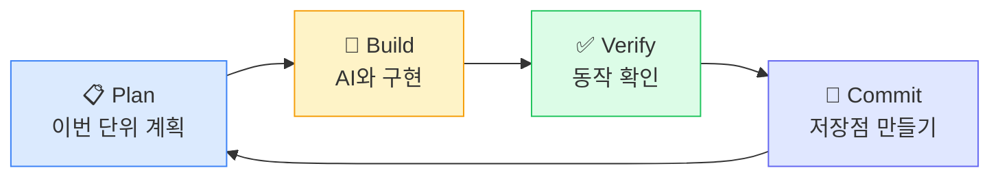
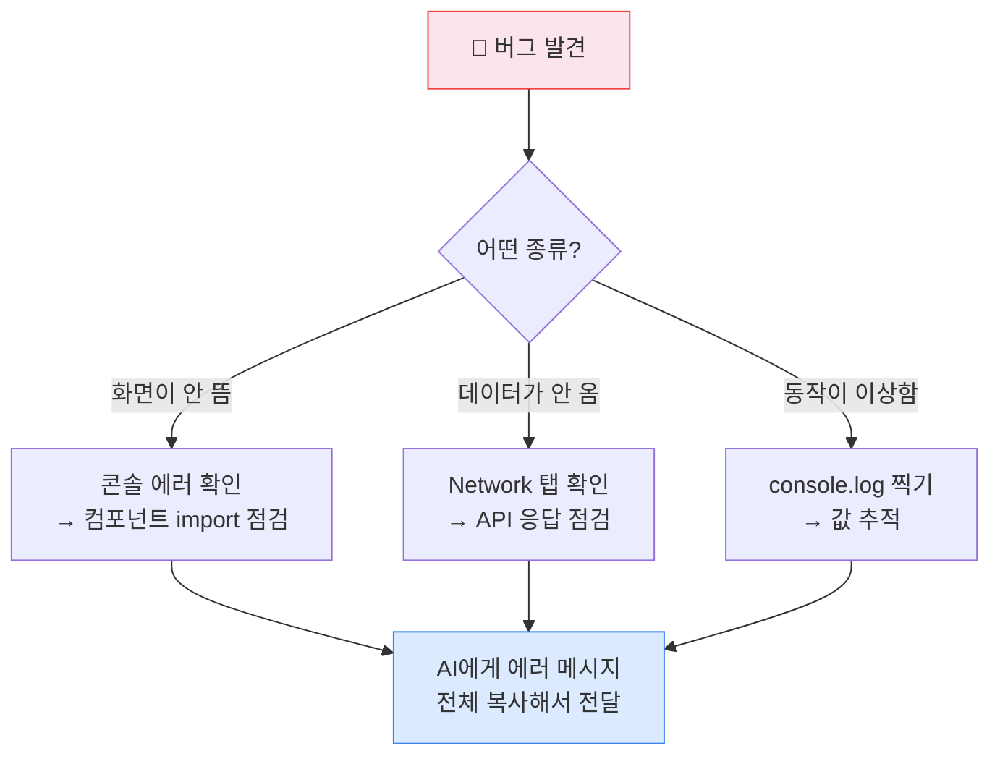

Ch.12에서 설계도를 완성했습니다. 프로젝트를 골랐고, 기술 스택을 정했고, 기획서(PRD)까지 작성했습니다.

이제 짓습니다.

솔직히 말하면, 이 순간이 가장 떨립니다. 이론을 배울 때는 괜찮았는데, 진짜 만들기 시작하면 갑자기 확신이 사라집니다. "내가 진짜 할 수 있나?" "에러가 나면 어쩌지?"

Part 1에서 프로덕트 구조를 배웠고, Part 2에서 아이디어를 다듬었고, Part 3에서 도구까지 익혔습니다. 그 과정에서 축적된 이해가 있습니다. 다만, 처음이 떨리는 건 다 똑같습니다.

코딩 경험이 전혀 없는 한 비즈니스 리더는 크리스마스 연휴 3일 동안 AI만으로 앱 두 개를 만들어서 배포했습니다. 피아노 연습 앱과 감사 표현 앱. 대단한 앱이 아니었지만, "내가 만든 게 진짜 돌아간다"는 경험은 그 사람의 관점을 완전히 바꿨다고 합니다.

이 챕터는 그 3일의 여정을 압축한 가이드입니다. 코드를 보여주지 않습니다. 대신, **빌드의 리듬** — 지시하고, 확인하고, 에러 잡고, 저장하고, 다음으로 — 을 익힙니다. 이 리듬 하나가 빌드 전체를 관통합니다.

---

## 1. Build Loop: 빌드의 리듬을 익힌다

빌드를 시작하기 전에, 하나만 확실히 해둡시다.

**당신은 코더가 아닙니다. 지휘자입니다.**

오케스트라 지휘자가 바이올린을 직접 켜지 않듯이, 여러분은 코드를 직접 쓰지 않습니다. 대신 AI라는 연주자에게 어떤 곡을, 어떤 순서로, 어떤 느낌으로 연주할지를 지시합니다. AI가 엉뚱한 음을 내면 멈추고 다시 지시합니다.

이 지휘에는 리듬이 있습니다. 이 챕터에서 가장 중요한 한 가지입니다.

### Build Loop

<StepByStep>
<Step title="Plan — 계획을 먼저 요청한다">

AI에게 코드를 시키기 전에, 먼저 계획을 받습니다.

"먼저 코드를 작성하지 말고, 이 기능을 구현하기 위한 단계별 계획을 설명해줘."

AI가 어떤 파일을 만들고, 어떤 순서로 작업할지 보여줍니다. 여러분이 그 계획을 보고 승인합니다. AI가 엉뚱한 방향으로 달려가는 것을 시작 전에 막을 수 있습니다.

</Step>
<Step title="Build — 한 단계를 실행한다">

승인한 계획대로 Phase 하나를 실행합니다.

"이 PRD를 읽고, Phase 1을 구현해줘. Phase 1이 끝나면 멈추고 결과를 설명해줘."

핵심은 **Phase 단위로 끊는 것**과 **"멈추고 설명해줘"를 반드시 붙이는 것**입니다. 이걸 안 하면 AI는 Phase 1 끝내고 바로 2, 3, 4까지 한 번에 달려갑니다.

</Step>
<Step title="Verify — 눈으로 직접 확인한다">

AI가 "완료했습니다"라고 해도 반드시 직접 확인합니다. 화면이 나오는지, 버튼이 작동하는지, 데이터가 저장되는지. AI의 보고를 믿지 말고 직접 테스트합니다.

</Step>
<Step title="Commit — Git에 저장한다">

확인이 끝나면 저장점을 만듭니다. "로그인 기능 완성" — 커밋. "게시물 목록 완성" — 커밋. AI가 다음 단계에서 코드를 망가뜨려도 이 시점으로 되돌아올 수 있습니다. 게임의 세이브 포인트입니다.

</Step>
<Step title="Next — 다음 Phase로 넘어간다">

같은 루프를 반복합니다. Plan → Build → Verify → Commit → Next. 이 리듬이 빌드 전체를 관통합니다.

</Step>
</StepByStep>

이게 전부입니다. **작게 지시하고, 즉시 검증하고, 안전하게 저장한다.** 이 한 문장이 Ch.13의 핵심입니다.

<Callout type="warning">
"내 PRD 전체 읽고 다 만들어줘"는 가장 흔한 실수입니다. AI는 정말 열심히 만들지만, 결과물의 절반은 작동하지 않습니다. 한꺼번에 많이 시킬수록 디버깅이 기하급수적으로 어려워집니다. Build Loop의 핵심은 한 번에 하나씩, 작게 끊는 것입니다.
</Callout>

### 왜 한 번에 다 시키면 안 되는가

"내 PRD 전체 읽고 다 만들어줘." 이렇게 하면 어떻게 될까요?

AI는 정말 열심히 만듭니다. 화면도 나오고, 버튼도 생기고, 뭔가 그럴듯해 보입니다. 근데 회원가입을 눌러보면 안 되고, 데이터를 입력하면 사라지고, 한 곳을 고치면 다른 곳이 깨집니다.

Ch.11에서 배운 기술 부채가 첫날부터 산더미처럼 쌓입니다. 그래서 Ch.12에서 수직적 슬라이스로 나눠둔 것이고, 그래서 Build Loop에서 Phase 단위로 끊는 겁니다.

### 빌드 순서: 무엇을 먼저 만드나

각 Phase 안에서도 순서가 있습니다. 실전에서 검증된 순서입니다.

| 순서 | 단계 | 핵심 |
|------|------|------|
| 1 | **화면(UI) 먼저** | 가짜 데이터여도 괜찮다. "어떻게 생겼는지" 눈으로 확인 |
| 2 | **데이터베이스 연결** | 화면 뒤에 진짜 데이터 저장소를 붙인다 |
| 3 | **인증(로그인)** | 필요한 경우만. Ch.12 레시피 추천기처럼 불필요하면 건너뛴다 |
| 4 | **핵심 기능** | 수직적 슬라이스의 본격 시작. 버튼→처리→결과 한 사이클 완성 |
| 5 | **다음 기능** | 4단계를 반복. 한 번에 하나씩 |

이 순서가 익숙하게 느껴진다면 맞습니다. Part 1에서 배운 5가지 구성요소 — 프론트엔드, API, 백엔드, 데이터베이스, 인프라 — 를 한 겹씩 쌓아가는 과정입니다.

꼭 이 순서일 필요는 없습니다. 프로젝트마다 다릅니다. 하지만 한 가지는 변하지 않습니다. **한 번에 하나씩, Build Loop를 돌면서.**

<SelfCheck question="Ch.12에서 만든 PRD를 열어보세요. Phase 1에 해당하는 기능이 빌드 순서 5단계 중 어디까지 포함되나요?" hint="Phase 1은 대부분 1단계(화면)와 일부 2단계(데이터 연결)를 포함합니다. 너무 많은 단계를 Phase 1에 넣었다면 더 쪼개는 것이 좋습니다.">
Phase 1은 화면이 뜨는 것만으로도 충분한 성과입니다. 데이터베이스 연결이나 AI 연동은 Phase 2, 3으로 나눠도 됩니다.
</SelfCheck>

> **✅ 1막 완료 — Build Loop를 이해했습니다.** Plan → Build → Verify → Commit → Next. 이 리듬으로 빌드합니다. 이제 이 루프 안에서 가장 많은 시간을 차지하는 것 — 에러 대처 — 를 다룹니다.

---

## 2. 에러가 나면: 빌드의 일부로 다루는 법

빌드를 시작하면, 에러를 만납니다.

화면이 하얗게 변하거나, 버튼을 눌러도 아무 반응이 없거나, 빨간 글자가 잔뜩 뜨거나. 심장이 쿵 하죠.

**이건 정상입니다.** 바이브코딩 경험자들이 하나같이 하는 말이 있습니다. 빌드 시간 중 대부분이 디버깅에 쓰인다고요. 코드를 만드는 건 짧은 시간, 에러를 잡는 게 긴 시간. 이건 비개발자만 그런 게 아니라 개발자들도 마찬가지입니다.

<Callout type="tip">
에러가 난다는 건 실패가 아닙니다. Build Loop의 Verify 단계에서 발견한 것일 뿐입니다. 전문 개발자도 코딩 시간보다 디버깅 시간이 더 길 때가 많습니다. 에러를 만날 때마다 "이건 정상적인 과정"이라고 생각하세요.
</Callout>

에러가 난다는 건 실패가 아닙니다. Build Loop의 Verify 단계에서 발견한 것일 뿐입니다. 문제는 에러가 나느냐가 아니라, **에러를 만났을 때 어떻게 하느냐**입니다.

### 에러 보고 3요소

Ch.10에서 AI에게 맥락을 주는 법을 배웠습니다. 에러 상황에서도 똑같은 원리가 적용됩니다. 코드를 읽을 줄 몰라도, 이 3가지만 전달하면 됩니다.

**① 뭘 했는가** — "회원가입 버튼을 눌렀습니다."

**② 뭘 기대했는가** — "가입 완료 메시지가 나와야 합니다."

**③ 실제로 뭐가 일어났는가** — "페이지가 하얗게 변했습니다. 브라우저 콘솔에 이런 에러가 나옵니다: [에러 메시지 붙여넣기]"

에러 메시지는 어디서 찾냐고요? 웹 앱이라면 브라우저에서 **F12**를 눌러서 **콘솔(Console)** 탭을 확인하세요. 빨간색 글자가 에러입니다. 그 내용을 통째로 복사합니다.

그리고 한 가지 중요한 것. **"고쳐줘"라고만 하지 마세요.**

AI에게 "고쳐줘"라고 하면, AI는 자기가 판단한 원인 하나만 골라서 코드를 수정합니다. 그게 틀리면 또 다른 에러, 또 "고쳐줘", 무한 반복. 대신 이렇게 물어보세요.

- "이 에러 메시지가 무슨 뜻인지 설명해줘"
- "이 문제의 원인이 될 수 있는 것 3가지를 알려줘"
- "이 에러를 해결하기 위한 단계별 방법을 알려줘"

원인을 먼저 이해하면, 올바른 방향으로 수정할 확률이 극적으로 올라갑니다. 수정 후에는 반드시 같은 동작을 다시 해서 에러가 사라졌는지 확인합니다 — 이것이 Build Loop의 Verify입니다.

### 자주 만나는 에러 패턴

에러는 수천 가지가 있지만, 비개발자가 바이브코딩에서 반복적으로 만나는 패턴은 몇 가지로 압축됩니다. 이것만 알아두면 대부분 대응할 수 있습니다.

**하얀 화면** — 앱을 열면 완전히 하얀 화면만 나옵니다. 대부분 "있어야 할 데이터가 없을 때" 발생합니다. F12 콘솔에서 에러를 복사하고, "이 에러 때문에 화면이 하얗게 나옵니다"라고 AI에게 전달하세요.

**데이터가 저장 안 됨** — 폼에 입력하고 저장했는데, 새로고침하면 사라집니다. AI가 화면에만 임시로 보여주고 실제 데이터베이스에 저장하는 코드를 빠뜨린 겁니다. 이건 AI가 특히 자주 하는 실수 — 그럴듯한 가짜 데이터로 화면만 채워놓는 패턴입니다. "이 폼 데이터가 데이터베이스에 실제로 저장되는지 확인해줘"라고 물어보세요.

**환경 변수 누락** — "내 컴퓨터에서는 되는데, 배포하면 안 돼요." Ch.8에서 배운 환경 변수를 배포 서버에 등록하지 않았을 때 발생합니다. 배포 플랫폼 설정에서 환경 변수를 등록하면 해결됩니다.

이 외에도 CORS 에러(프론트엔드↔백엔드 간 보안 정책 차단), 빌드 실패(배포 시 파일 누락) 등이 있지만, 대처법은 동일합니다. **에러 보고 3요소로 AI에게 전달하고, 원인을 먼저 이해한 후 수정.**

> **✅ 2막 완료 — 에러 대처 감각을 잡았습니다.** 에러는 빌드의 일부이고, 3요소 보고로 해결합니다. 이제 더 까다로운 상황 — AI가 같은 실수를 반복할 때, 그리고 빌드의 완료를 판단하는 법 — 을 다룹니다.

---

## 3. AI가 같은 실수를 반복할 때

에러를 만나서 AI에게 물어봤습니다. AI가 수정했습니다. 근데 또 에러. 또 물어봤습니다. 또 수정. 또 에러...

이런 상황을 **디버깅 루프**라고 합니다. 바이브코딩에서 가장 좌절스러운 순간입니다.

왜 이런 일이 일어날까요? Ch.10에서 **컨텍스트 윈도우**를 배웠습니다. AI가 한 번에 기억할 수 있는 대화의 양에 한계가 있다는 것. 디버깅이 길어지면 대화 안에 실패한 시도들이 쌓이면서 AI가 점점 혼란에 빠집니다. 이전에 실패했던 방법을 다시 제안하거나, 전혀 관련 없는 곳을 수정하기 시작합니다. 이것을 **컨텍스트 오염**이라고 합니다.

### 루프 탈출 3가지

**1. 새 대화를 시작한다.** 가장 간단하고 효과적입니다. 대화창을 닫고, 새로운 대화에서 문제를 깨끗하게 다시 설명합니다.

"새로운 대화입니다. 현재 상황: 회원가입 기능을 만들고 있는데, 이메일 입력 후 가입 버튼을 누르면 이런 에러가 나옵니다: [에러 메시지]. 이전에 A 방법과 B 방법을 시도했지만 해결되지 않았습니다. 다른 접근 방법을 제안해주세요."

**2. 다른 AI에게 물어본다.** Cursor를 쓰고 있었다면 Claude에게, Claude를 쓰고 있었다면 ChatGPT에게 같은 질문을 해보세요. 모델마다 학습한 패턴이 달라서, 완전히 다른 각도의 해결책이 나올 수 있습니다.

**3. 마지막 커밋으로 돌아간다.** Build Loop에서 Commit을 해둔 이유가 바로 이겁니다. "마지막으로 잘 되던 시점"으로 되돌아가서 다시 시작합니다. 커밋이 없으면 이 전략을 쓸 수 없습니다 — 그래서 Commit 단계를 절대 건너뛰면 안 됩니다.

세 번째 전략이 가능하려면 습관이 필요합니다. **기능 하나가 작동할 때마다 커밋.** 이건 Build Loop에 이미 내장되어 있습니다. 게임의 세이브 포인트와 같습니다. 보스전 직전에 세이브하듯이, AI가 다음 기능을 망가뜨리기 전에 저장해둡니다. Git 명령어가 어렵다면 AI에게 "지금까지 작업한 내용을 '로그인 기능 완성'이라는 메시지로 Git에 커밋해줘"라고 말하면 됩니다.

<Callout type="warning">
커밋 없이 빌드를 계속하는 것은 세이브 없이 보스방에 들어가는 것과 같습니다. AI가 실수로 코드를 망가뜨려도 되돌아올 지점이 없습니다. "Verify까지 통과했다 = 커밋" — 이걸 습관으로 만드세요.
</Callout>

---

## 4. "이거 다 됐어?" — 기능 완료를 판단하는 법

AI가 "완벽하게 작동합니다!"라고 말하면, 절대 그대로 믿지 마세요.

AI는 자신만만합니다. "추가했습니다", "수정했습니다", "이제 정상 작동합니다" — 확인해보면 절반은 거짓말입니다. Build Loop의 Verify가 중요한 이유입니다.

코드를 읽을 줄 몰라도, 이 체크리스트로 직접 검증할 수 있습니다.

### 기능 완료 체크리스트

**□ 기획서와 대조했는가?**
PRD에 적힌 대로 기능이 동작하는지 하나하나 확인합니다.

**□ 정상 경로를 테스트했는가?**
의도한 순서대로 사용했을 때 문제없이 끝까지 가는지 확인합니다.

**□ 비정상 경로를 테스트했는가?**
빈 칸으로 제출하기, 엉뚱한 값 입력하기, 버튼 연타하기. 앱이 깨지지 않고 적절한 안내 메시지를 보여주는지 확인합니다.

**□ 데이터가 진짜 저장되었는가?**
새로고침해도 데이터가 살아있는지 확인합니다. AI가 가짜 데이터로 화면만 채워놓는 경우, 여기서 드러납니다.

**□ 커밋했는가?**
위 네 가지를 모두 통과했으면, Build Loop의 Commit. Git에 저장합니다.

다섯 개 모두 통과? 그 기능은 끝났습니다. 다음 Phase로 넘어갑니다.

---

## 5. 빌드의 판단력: 언제 멈추고, 언제 넘어가는가

Build Loop를 돌다 보면, 이상한 유혹에 빠집니다.

"버튼 색깔이 마음에 안 들어."
"로딩 화면이 좀 더 세련됐으면 좋겠는데."
"이 기능, 조금만 더 손보면 완벽할 것 같은데..."

AI가 80~90%를 뚝딱 만들어놓으면, 나머지를 완성하고 싶은 욕구가 솟아오릅니다. "프롬프트 한 번만 더", "5분만 더." 근데 그 5분이 5시간이 됩니다.

이것을 **마지막 10% 함정**이라고 합니다. 무서운 건, 이게 좌절스럽지 않다는 겁니다. 오히려 몰입이 높아서 시간 가는 줄 모릅니다.

여기서 기억해야 할 것: **기능 완료 체크리스트의 5항목을 통과했으면, 그 기능은 끝난 겁니다.** 버튼 색깔, 로딩 애니메이션, 폰트 크기 — 이건 "다음에 할 일"이지 "지금 할 일"이 아닙니다.

<SelfCheck question="지금 작업 중인 기능에서 '좀 더 다듬으면 완벽할 것 같다'는 생각이 든다면, 기능 완료 체크리스트 5개를 모두 통과했나요?" hint="체크리스트 5개를 모두 통과했다면, 그 기능은 이미 완료된 것입니다. 다듬고 싶은 욕구는 마지막 10% 함정일 수 있습니다.">
기능 완료의 기준은 체크리스트입니다. 완벽한 느낌이 아니라, 5개 항목 통과 여부로 판단하세요.
</SelfCheck>

### 리팩토링: 정리는 언제 하나

프로그래밍 세계에 오래된 격언이 있습니다. **"먼저 돌아가게 만들어라. 그 다음에 올바르게 만들어라."**

바이브코딩에서 이건 이런 뜻입니다.

**1단계 — 돌아가게 만든다.** 코드가 지저분해도 기능이 의도대로 작동하기만 하면 됩니다. AI가 만든 초기 코드가 비효율적이고 복잡한 건 정상입니다.

**2단계 — 올바르게 만든다 (리팩토링).** 한 기능의 빌드가 끝나고, 다음 기능으로 넘어가기 직전이 최적의 시점입니다. 리팩토링은 AI에게 구체적으로 요청합니다.

- "이 파일이 너무 길어. UI 코드와 API 호출 코드를 별도 파일로 분리해줘."
- "반복되는 코드가 있으면 찾아서 재사용 가능한 함수로 만들어줘."

"코드 정리해줘"처럼 모호하게 시키면 AI가 엉뚱한 곳을 고칩니다. 그리고 한 가지 팁: **리팩토링은 새 대화 세션에서 하세요.** 코드를 만든 AI 세션에서 리뷰를 요청하면, AI가 자기 결과물에 편향된 시각을 가질 수 있습니다.

**3단계 — 빠르게 만든다 (최적화).** 사용자가 많아지고 속도가 느려질 때 하면 됩니다. 첫 프로젝트에서는 여기까지 올 필요가 거의 없습니다.

Ch.7에서 배운 MVP의 정신이 빌드 과정에도 그대로 적용됩니다. 불완전한 첫 버전은 실패가 아니라 "질문지"입니다. 사용자에게 "이거 필요해?"라고 물어보는 것.

> **✅ 3막 완료 — 빌드 판단력을 장착했습니다.** 체크리스트로 완료를 판단하고, 완벽주의 함정을 피하고, 정리 타이밍을 압니다.

---

## 졸업 테스트

다음 질문에 답해보세요.

**Q1.** Build Loop의 5단계를 순서대로 말해보세요. 그리고 이 중 가장 건너뛰기 쉬운 단계는 무엇이고, 왜 건너뛰면 안 되나요?

**Q2.** 에러가 났을 때 AI에게 전달해야 할 3요소는 무엇인가요?

**Q3.** AI가 같은 에러를 반복해서 고치지 못할 때, 시도할 수 있는 방법 3가지를 말해보세요.

**Q4.** 이 챕터의 핵심 기준은 무엇이었나요? 작게 ___하고, 즉시 ___하고, 안전하게 ___한다.

**Q5.** 지금 바로 해보기: 만들고 싶은 앱의 첫 번째 Phase를 AI에게 시키되, "먼저 구현 계획을 설명해줘"라고 말해보세요. AI가 제안한 계획이 합리적인지 스스로 판단해보세요.

---

<KeyTakeaway>

- "작게 지시하고, 즉시 검증하고, 안전하게 저장한다"
- "Build Loop: Plan → Build → Verify → Commit → Next"
- "에러의 3가지 핵심 패턴: 환경변수, 하얀 화면, 가짜 데이터"

</KeyTakeaway>

<ActionItem>
다음에 AI에게 작업을 시킬 때, Build Loop 한 사이클(지시→검증→커밋)을 의식적으로 실행해보세요.
</ActionItem>

---

## 다음으로

Build Loop를 돌면서, 한 단계씩. Plan, Build, Verify, Commit, Next.

이 리듬이 자연스러워졌다면, 여러분의 프로덕트는 이미 shape이 잡히고 있을 겁니다. 화면이 있고, 데이터가 저장되고, 핵심 기능이 동작합니다.

Ch.14에서는 이 프로덕트를 세상에 내놓습니다. 내 컴퓨터에서만 돌아가던 것을, 인터넷에 올려서 누구나 접속할 수 있게 만드는 배포와 런칭. Ch.8에서 이론으로 배웠던 그 과정을, 이번에는 직접 해봅니다.

건축가(Ch.11)가 설계도(Ch.12)를 그렸고, 건물을 올렸습니다(Ch.13). 이제 문을 열 차례입니다.

<NextPreview>
빌드 리듬을 익혔습니다. 이제 만든 것을 세상에 내보내고, 첫 반응을 받을 차례입니다. Ch.14에서 런칭과 검증의 기술을 배웁니다.
</NextPreview>

---

## 더 읽기

- **비개발자의 AI 빌드 경험기:** [Lessons in AI-Assisted Coding from a Non-Engineer — Loomery](https://www.loomery.com/insights/lessons-in-ai-coding-from-a-non-engineer) — 코딩 경험 없는 비즈니스 리더의 3일간 빌드 회고록
- **바이브코딩 디버깅 실전 가이드:** [How To DEBUG Vibe Code — Matas Rimkus](https://medium.com/@matasr/how-to-debug-vibe-code-96160324777c) — 코드를 모르는 사람을 위한 에러 대처 워크플로우
- **완벽주의 함정에서 벗어나기:** [Why Vibe Coding Thrives on Imperfection — Koder](https://koder.ai/blog/why-vibe-coding-thrives-on-imperfection-and-change) — "불완전해도 출시하라"는 바이브코딩 철학
