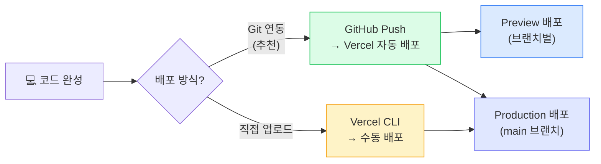

건축가(Ch.11)가 설계도(Ch.12)를 그렸고, 건물을 올렸습니다(Ch.13).

이제 문을 엽니다.

솔직히, 이 순간이 빌드보다 더 떨립니다. 에러를 고칠 때는 나만 보는 거니까 괜찮았는데, 배포하면 다른 사람이 봅니다. "이거 별로인데?" 소리 들을까 봐, 배포 버튼 앞에서 멈칫하게 됩니다.

그 멈칫함이 정상입니다. 근데 하나만 기억하세요. **지금 공개하지 않으면, 학습이 시작되지 않습니다.** 내 머릿속에서는 "좀 더 다듬으면 좋겠는데"가 맴돌지만, 진짜 필요한 정보 — 이게 사람들에게 필요한 건지 아닌지 — 는 배포해야만 얻을 수 있습니다.

<Callout type="tip">
"준비될 때까지 기다리면 영원히 런칭 못 한다"는 말은 진담입니다. 완벽하지 않아도 괜찮습니다. 5~10명이 쓸 수 있는 수준이면 충분합니다. 배포 버튼을 누르는 순간이 학습의 시작입니다.
</Callout>

Ch.13에서 Build Loop의 핵심이 "검증"이었듯, 런칭도 같습니다. **런칭은 끝이 아니라, 가장 큰 검증 실험의 시작입니다.**

이 챕터는 세 가지를 합니다. **배포 전 점검, 실제 공개, 그리고 첫 반응에서 배우기.**

---

## 1막: 카운트다운 — 배포 전 점검과 실제 배포

### 배포 전 체크리스트: 3가지 핵심

Ch.8에서 배포의 4가지 톱니바퀴를 배웠습니다. 그때는 "이런 게 있구나" 수준이었다면, 이제 실제로 확인할 차례입니다. 전부 다 꼼꼼히 할 필요는 없습니다 — 이 3가지만 확인하면 첫 배포에서 터지는 문제의 대부분을 막을 수 있습니다.

**□ 환경 변수를 배포 플랫폼에 등록했는가?**

`.env` 파일에 있는 값들(API 키, 데이터베이스 비밀번호 등)은 내 컴퓨터에만 있습니다. 배포 서버에는 하나하나 직접 등록해줘야 합니다. 이걸 까먹는 게 배포 실패 원인 1등입니다 — 농담 아니고 진짜. AI에게 "내 프로젝트에서 사용하는 환경 변수 목록을 전부 알려줘"라고 물어보세요.

**□ 코드에 비밀 정보가 노출되지 않았는가?**

가끔 AI가 편의상 API 키를 코드 안에 직접 써넣을 때가 있습니다. 이 상태로 배포하면 그 키가 인터넷에 공개됩니다. "코드 안에 하드코딩된 API 키나 비밀번호가 있는지 확인해줘"라고 AI에게 요청하세요.

**□ localhost 주소가 남아 있지 않은가?**

개발 중에 `http://localhost:3000/api/...` 같은 주소로 API를 호출하고 있었다면, 배포하면 당연히 안 됩니다. 배포 서버에는 localhost가 없으니까요. "코드에서 localhost를 참조하는 부분이 있는지 찾아줘"라고 AI에게 확인하세요.

<Callout type="warning">
API 키가 코드에 직접 노출된 채로 GitHub에 올라가면, 자동화 봇이 몇 분 안에 이를 감지하고 악용합니다. OpenAI, Supabase 등 대부분의 서비스는 이런 경우 해당 키를 자동으로 무효화하고 이메일로 경고를 보냅니다. 배포 전 반드시 확인하세요.
</Callout>

---

### 배포: Deploy 버튼을 누르는 순간

체크리스트를 통과했으면, 진짜 배포합니다. 어떤 도구로 만들었느냐에 따라 방법이 달라집니다.

#### 길 A: AI 네이티브 도구 (Lovable, Bolt)

Lovable이나 Bolt로 만들었다면, 배포는 놀라울 정도로 간단합니다. 에디터에서 **"Publish" 버튼**을 누릅니다. URL을 설정하고, Publish. 끝입니다. 1분도 안 걸립니다.

프랜차이즈에서 인테리어부터 간판까지 다 해주는 거죠. 편리하지만, 세세한 커스터마이징에는 한계가 있습니다.

#### 길 B: Cursor/Claude Code → Vercel

Cursor나 Claude Code로 만들었다면 몇 단계가 더 있습니다. 하지만 AI가 다 도와줍니다.

<StepByStep>
<Step title="1. GitHub에 코드 올리기">
AI에게 "이 프로젝트를 GitHub에 올려줘"라고 말합니다. Ch.13에서 배운 Git 커밋이 여기서 쓰입니다.
</Step>
<Step title="2. Vercel에 프로젝트 연결">
Vercel 사이트에 GitHub 계정으로 로그인하고, "Import Project"에서 방금 올린 저장소를 선택합니다.
</Step>
<Step title="3. 환경 변수 등록 (핵심!)">
Vercel 대시보드의 Settings → Environment Variables에서, `.env` 파일에 있던 값들을 하나하나 등록합니다. 스페이스 하나, 따옴표 하나 차이로 안 될 수 있습니다.
</Step>
<Step title="4. Deploy 버튼 누르기">
"Deploy" 버튼을 누릅니다. 몇 분 안에 `your-project.vercel.app` 같은 URL이 생깁니다.
</Step>
</StepByStep>

직접 매장을 차리는 거죠. 더 손이 가지만, 모든 걸 내 마음대로 할 수 있습니다.

---

### 배포했는데 안 될 때

첫 배포에서 한 번에 성공하는 경우가 오히려 드뭅니다. 당황하지 마세요.

**"Build failed" — 빌드 실패**

Vercel 대시보드에 빨간 글자가 뜹니다. 내 컴퓨터에서는 잘 돌아가는 코드가 배포 서버에서 실패하는 겁니다. **대처법:** "Build Logs"를 찾아서 에러 메시지 전체를 복사하고, AI에게 "이 빌드 로그를 보고 실패 원인을 분석해줘"라고 전달합니다. Ch.13에서 배운 에러 보고 방식 그대로입니다.

**화면은 나오는데 기능이 안 돼요**

99%는 환경 변수 문제입니다. 배포 플랫폼의 환경 변수 설정을 열고, 로컬 `.env` 파일과 하나하나 대조합니다. 수정 후에는 반드시 **재배포(Redeploy)**를 해야 적용됩니다 — 고치기만 하고 재배포 안 해서 "여전히 안 돼요"라는 사람이 정말 많습니다.

**특정 페이지에서 404가 뜹니다**

메인 페이지는 뜨는데, 다른 페이지로 갔다가 새로고침하면 404. React 같은 프레임워크는 실제로 `index.html` 하나로 모든 페이지를 흉내내는 구조(<Term def="Single Page Application. HTML 파일 하나로 모든 페이지를 클라이언트에서 렌더링하는 방식. 새로고침 시 서버가 해당 경로를 모르면 404가 뜨는 원인">SPA</Term>)인데, 서버가 이걸 모릅니다. AI에게 "배포 후 페이지 새로고침 시 404가 뜨는 문제를 해결해줘"라고 말하면 설정 파일 하나를 추가해서 해결됩니다.

핵심은 이겁니다 — **배포 에러도 빌드 에러와 다르지 않습니다.** Ch.13의 에러 보고 3요소(뭘 했는지, 뭘 기대했는지, 뭐가 나왔는지)를 그대로 적용하면 됩니다.

---

### ✅ 1막 체크포인트

여기까지 오셨으면, 배포 전 점검 → 실제 배포 → 에러 대처까지 마친 겁니다. `your-project.vercel.app` (또는 Lovable/Bolt의 공개 URL)이 생겼을 겁니다.

이 URL을 본인 휴대폰 브라우저에서 열어보세요. 내 컴퓨터가 아닌 다른 기기에서 내가 만든 서비스가 뜨는 순간 — 그 느낌을 기억해두세요.

근데 지금은 이 URL을 아는 사람이 세상에 여러분 한 명뿐입니다. 여기서 멈추면, 검증 실험은 시작되지 않습니다.

---

## 2막: 개장 — 첫 반응에서 배우기

### URL을 보내는 순간

카카오톡 대화창에 URL을 붙여넣습니다. 전송 버튼 위에서 잠깐 멈칫합니다. "진짜 보내도 되나? 아직 부족한데..."

Ch.7에서, Ch.12에서, Ch.13에서 — 계속 같은 말을 했습니다. 완벽함이 아니라 검증이 먼저라고. 이 순간이 그 모든 말이 진짜가 되는 순간입니다.

전송을 누릅니다.

상대방이 "오 이거 뭐야, 진짜 서비스네?"라고 반응하는 순간.

**이게 겁니다.** Ch.0에서 "코딩을 몰라도 프로덕트를 만들 수 있다"고 했죠? 여러분이 직접 증명한 겁니다. URL이 있고, 다른 사람이 접속할 수 있고, 실제로 동작합니다. 이건 데모가 아니라 프로덕트입니다.

근데 이 감동에 젖어 있을 시간은 없습니다. 지금부터가 진짜입니다. 그 상대방의 반응이 — 좋든 나쁘든 — 여러분의 첫 학습 데이터니까요.

---

### 첫 유저는 몇 명이면 충분한가

수백 명, 수천 명이 필요하지 않습니다. 처음에 필요한 건 **5~10명**입니다.

이 5~10명은 고객이 아닙니다. **테스트 파트너**입니다. 기대하는 건 결제가 아니라 솔직한 반응.

**어디서 찾나요?**

- **주변 사람.** 친구, 동료, 가족. "내가 이런 거 만들었는데 한번 써볼래?" 가장 쉽고 빠릅니다. 다만 친한 사람은 "좋다"고만 할 수 있으니, "안 좋은 점을 하나만 알려줘"라고 꼭 물어보세요.
- **관련 커뮤니티.** 타겟 유저가 모인 곳 — 레딧, 페이스북 그룹, 디스코드, 카카오톡 오픈채팅. "이런 문제를 해결하는 서비스를 만들어봤는데, 피드백 주실 분 계신가요?"

Product Hunt나 Hacker News 같은 플랫폼도 있지만, 첫 프로젝트에서 거기까지 갈 필요는 없습니다. **지금은 5~10명이면 충분합니다.**

<SelfCheck question="URL을 보낼 첫 5명을 지금 떠올릴 수 있나요? 이름이 바로 생각나나요?" hint="친구 2명, 동료 2명, 관련 커뮤니티 1명 — 이 5명이 테스트 파트너입니다. 이름이 떠오르지 않는다면, 어떤 사람이 이 서비스를 필요로 하는지부터 생각해보세요.">
첫 5명이 구체적일수록 피드백의 질이 올라갑니다. "아무나"가 아니라 실제로 이 문제를 가진 사람에게 보여줄수록 의미 있는 반응을 얻습니다.
</SelfCheck>

---

### 피드백 수집: 3가지만 물어보세요

유저가 써봤습니다. 이제 뭘 물어봐야 할까요?

"어때?"라고 물어보면, "좋아"라고 답합니다. 이건 쓸모없는 피드백입니다. 마치 "밥 먹었어?"에 "응"이라고 답하는 것처럼 — 아무 정보도 없습니다.

좋은 피드백은 좋은 질문에서 나옵니다. **3가지만 물어보세요.**

**"이 서비스가 내일 사라지면 어떨 것 같아?"**

이 질문이 가장 강력합니다. "매우 아쉽다"고 답하는 사람이 40% 이상이면, 프로덕트-마켓 핏(PMF)에 가까운 강력한 신호입니다. 10명 중 4명이 "없으면 곤란하다"고 하면, 뭔가를 잡은 겁니다. 반대로 대부분이 "별로 상관없다"고 하면 — 그것도 중요한 데이터입니다.

**"가장 헷갈렸던 부분이 어디야?"**

이 답변이 다음에 고칠 화면을 바로 알려줍니다. 유저가 "여기서 뭘 해야 할지 모르겠더라"고 하면, 그 화면이 우선순위 1번입니다.

**"이걸 친구에게 어떻게 설명할 것 같아?"**

이 답변이 금입니다. 유저가 쓰는 말이 곧 마케팅 카피가 됩니다. 여러분이 생각한 설명보다, 유저 입에서 나오는 설명이 더 와닿을 때가 많습니다.

이 3가지면 충분합니다. 카카오톡이나 줌으로 직접 물어봐도 좋고, Google Forms로 간단한 설문을 만들어서 URL과 함께 보내도 좋습니다. 5~10명이라면 직접 대화하는 게 가장 깊은 인사이트를 줍니다.

<Callout type="info">
피드백 3문항을 메모장에 복사해두세요. URL을 보내는 사람마다 이 질문을 자연스럽게 넣으면 됩니다. "한번 써보고 이거 3가지만 알려줘"라고 함께 보내면 답변율이 높아집니다.
</Callout>

---

### 피드백을 받은 다음에는?

피드백이 쌓이면, 패턴을 찾습니다.

**여러 사람이 같은 문제를 지적하면** → 진짜 문제입니다. 다음 빌드에서 첫 번째로 고칩니다.

**"버그 있어요" 종류의 피드백** → 고치면 됩니다. 방향이 맞다는 뜻이니 긍정적인 신호.

**"왜 이걸 써야 하는지 모르겠어" 종류의 피드백** → 이건 심각합니다. 기능이 아니라 가치 제안 자체의 문제입니다. Ch.6~7을 다시 꺼내봐야 할 수도 있습니다.

이 세 가지 패턴 중 여러분의 피드백이 어디에 해당하는지 — 그게 다음에 뭘 해야 하는지를 알려줍니다.

---

### ✅ 2막 체크포인트

여기까지 오셨으면, 프로덕트를 공개하고 → 첫 유저에게 공유하고 → 피드백 3가지를 수집한 겁니다. 이제 "다음에 뭘 해야 하는지" 방향이 보이기 시작합니다.

---

## 3막: 문을 열었으면 — 최소한의 모니터링

프로덕트를 공개하고 유저를 초대했습니다. 끝일까요?

아닙니다. 식당을 열었으면 손님이 오는지 봐야 하고, 음식이 제대로 나가는지 확인해야 합니다. 하지만 첫 프로젝트에서 복잡한 모니터링 시스템이 필요하진 않습니다. **두 가지만 확인하면 됩니다.**

**살아 있는가?**

내 서비스에 접속이 되는가? UptimeRobot(무료)에 URL을 등록하면, 5분마다 접속을 시도하고 안 되면 이메일로 알려줍니다. 설정하는 데 5분이면 됩니다.

**누가 오는가?**

사람들이 실제로 오는가? Vercel에 배포했다면 대시보드에서 Analytics 탭을 켜고, AI에게 "Vercel Analytics를 내 프로젝트에 추가해줘"라고 말하면 됩니다. 쿠키 없이 방문자 수, 인기 페이지, 유입 경로를 볼 수 있습니다.

더 상세한 분석이 필요하면 Google Analytics 4(GA4)도 있습니다. 하지만 첫 프로젝트라면 Vercel Analytics만으로 충분합니다. **복잡한 건 유저가 늘어난 후에 고민하세요.**

첫 1주일에는 이 3가지만 봅니다: **사람이 오는가**(방문자 수), **어디서 오는가**(유입 경로), **어디서 떠나는가**(이탈 페이지). 0이 아니면 일단 OK.

---

## 한 사이클이 끝났습니다

잠깐 멈춰서 뒤를 돌아봅시다.

Ch.0에서 "세상이 바뀌었다"는 이야기로 시작했습니다. "코딩을 몰라도 프로덕트를 만들 수 있다고?" Ch.1~5에서 프로덕트의 구조를 하나하나 해부했습니다. 프론트엔드, 백엔드, API, 데이터베이스, 인프라. Ch.6~8에서 아이디어를 다듬고 배포의 원리를 이해했습니다. Ch.9~11에서 도구를 쥐었고, Ch.12에서 설계했고, Ch.13에서 빌드했습니다.

그리고 지금, Ch.14에서 세상에 내놓았습니다.

**당신은 프로덕트를 만들었습니다.** URL이 있고, 사람들이 접속할 수 있고, 피드백이 들어옵니다.

그리고 이제 무엇보다 중요한 것이 손에 들어왔습니다 — **실제 유저의 반응**. 이건 어떤 리서치나 기획 문서보다 값진 데이터입니다. "이 기능이 없어서 아쉬웠어"라고 했다면, 다음에 만들 것이 정해진 겁니다. "왜 써야 하는지 모르겠어"라고 했다면, 방향을 다시 잡아야 한다는 신호입니다.

어느 쪽이든, **이제 학습 루프가 돌기 시작했습니다.**

---

## 부록: 도메인 연결 (선택)

배포에 성공하면 `your-project.vercel.app` 같은 기본 URL이 생깁니다. **이걸로 충분합니다.** 첫 프로젝트라면 기본 URL로 런칭하고, 피드백을 받아본 후에 도메인을 달아도 늦지 않습니다.

하고 싶다면 3단계입니다: **도메인 구매**(가비아, Namecheap 등에서 연간 1~2만 원) → **Vercel에 도메인 등록** → **DNS 연결**(Ch.8에서 배운 "연락처 등록"). DNS 전파에 최대 48시간이 걸린다고 하지만, 실제로는 대부분 몇 분~1시간 이내입니다. HTTPS는 Vercel이 자동으로 설정해줍니다.

핵심은 도메인이 아니라, **지금 당장 공개할 수 있느냐**입니다.

---

<ProgressChecklist chapterId="ch14">
  <CheckItem>배포 전에 가장 먼저 확인해야 할 것이 무엇인지 말할 수 있다. 환경 변수를 등록하지 않으면 어떤 일이 벌어지는지도 설명할 수 있다</CheckItem>
  <CheckItem>Lovable/Bolt로 배포하는 것과 Cursor → Vercel로 배포하는 것의 가장 큰 차이를 설명할 수 있다</CheckItem>
  <CheckItem>첫 유저에게 "어때?"라고 물어보면 안 되는 이유와 대신 해야 할 3가지 질문을 말할 수 있다</CheckItem>
  <CheckItem>"이 서비스가 사라지면 어떨 것 같아?" 질문에서 40%가 "매우 아쉽다"고 답하면 어떤 의미인지 설명할 수 있다</CheckItem>
  <CheckItem action>프로덕트를 배포하고, 5명에게 URL을 보내고, 피드백 질문 3개를 물어봤다. 그 반응에서 다음에 할 것 한 가지를 정했다</CheckItem>
</ProgressChecklist>

---

<KeyTakeaway>

- "런칭은 끝이 아니라 검증 실험의 시작이다"
- "배포해야 학습이 시작된다"
- "첫 반응 5개가 다음 방향을 결정한다"

</KeyTakeaway>

<ActionItem>
지금 만들고 있는 프로젝트의 '첫 사용자 5명'을 구체적으로 떠올려보세요. 누구에게, 어떤 메시지로 보여줄 것인지 적어보세요.
</ActionItem>

---

## 다음으로

한 사이클이 끝났습니다. 아이디어에서 출발해서, 기획하고, 빌드하고, 배포하고, 첫 유저의 반응을 확인했습니다.

이제 손에 피드백이 있습니다.

"이 기능이 없어서 아쉬워"라고 했을 때, 바로 만들어야 할까요? "별로"라고 했을 때, 프로젝트를 접어야 할까요? "좋아!"라고 했을 때, 다음에 뭘 해야 할까요?

Ch.15에서는 이 질문에 답합니다. 첫 번째 사이클에서 배운 것을 가지고, **두 번째 사이클을 더 빠르게 돌리는 법.** 피드백을 프로덕트에 반영하고, 반복하고, 성장하는 이야기.

첫 번째 프로덕트가 완벽하지 않아도 됩니다. 오히려 완벽하지 않아야 합니다. 완벽하면 바꿀 게 없고, 바꿀 게 없으면 배울 게 없으니까요.

<NextPreview>
첫 반응을 받았습니다. 이제 그 반응을 해석하고, 두 번째 사이클을 더 빠르게 돌리는 법을 배울 차례입니다. 마지막 챕터, Ch.15로.
</NextPreview>

---

## 더 읽기

- **비개발자의 배포 완전 가이드:** [How to Deploy Cursor Project to Production — Last Hurdle](https://www.lasthurdle.agency/blog/how-to-deploy-cursor-project-to-production) — Cursor로 만든 프로젝트를 실제로 배포하는 step-by-step 가이드
- **첫 유저 확보 전략:** [Indie Hackers Share How They Got Their First 10, 100, and 1,000 Customers](https://www.indiehackers.com/post/indie-hackers-share-how-they-got-their-first-10-100-and-1-000-customers-620ce768ba) — 인디해커들의 실전 초기 유저 확보 경험담 모음
- **불완전한 출시의 힘:** [Overcoming the Fear of Launching an Incomplete Product](https://medium.com/thebeatenroad/overcoming-the-fear-of-launching-a-incomplete-product-23a2b0f68197) — "준비될 때까지 기다리면 영원히 런칭 못 한다"
