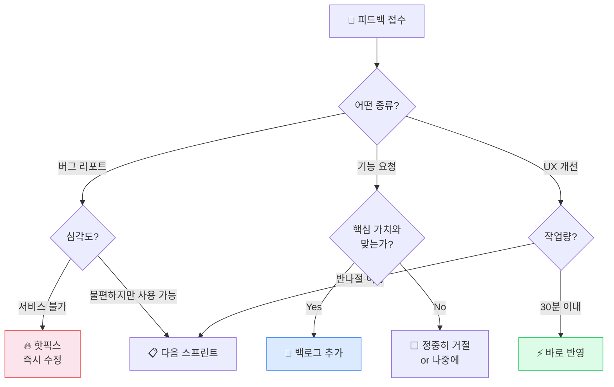

## 피드백이 도착했습니다

Ch.14 끝에서 3가지 갈림길을 던졌습니다. "이 기능이 없어서 아쉬워"라고 하면? "별로"라고 하면? "좋아!"라고 하면? 이번 챕터가 그 답입니다.

카카오톡으로 URL을 보내고 피드백 3가지 질문을 던졌습니다. 전송 버튼을 누르던 그 순간의 떨림이 아직 남아있을 겁니다. 그리고 답장이 오기 시작했습니다.

"로그인이 안 돼."
"이거 뭐 하는 앱이야? 설명이 없어서 모르겠어."
"오 좋은데? 이런 기능도 있으면 좋겠다."
"솔직히 안 쓸 것 같아."

어떤 반응은 기분이 좋고, 어떤 반응은 가슴이 철렁합니다. 처음 만든 프로덕트에 대한 첫 반응 — 이건 누구에게나 예민한 순간입니다.

근데 잠깐. 이 반응들을 받기 전의 당신과 지금의 당신은 같은 사람일까요?

Ch.0에서 "프로덕트를 만들 수 있을까?"라고 걱정하던 때를 떠올려보세요. 지금 당신은 아이디어를 정리하고(Ch.6), 기능을 분류하고(Ch.7), AI에게 지시해서 실제로 작동하는 것을 만들었고(Ch.12~13), 그걸 세상에 내놓았습니다(Ch.14). **실제 유저의 피드백을 받고 있는 사람.** 이건 "만들어봤다" 수준이 아니라, 프로덕트를 세상에 내놓고 반응을 받는 **빌더**의 위치입니다.

그리고 지금 손에 들어온 것 — 유저의 반응, 성공한 부분, 실패한 부분, 써본 도구, 효과 있던 프롬프트 — 이 모든 게 **데이터**입니다. 첫 프로젝트는 "성과"로 평가할 게 아닙니다. **다음 사이클을 더 빠르고 정확하게 돌리기 위한 데이터를 수집한 것**입니다.

이번 챕터에서는 세 가지를 합니다.

하나, **돌아봅니다.** 첫 사이클에서 어떤 데이터가 쌓였는지. 회고 없이 다음으로 넘어가면, 같은 삽질을 반복합니다.

둘, **가속합니다.** 그 데이터를 재사용 가능한 자산으로 바꾸고, 두 번째 사이클의 속도를 끌어올립니다.

셋, **판단합니다.** 피드백에서 진짜 신호를 가려내고, 밀어붙일지 방향을 바꿀지 결정합니다.

<BuilderCycle />

시작하겠습니다.

---

## 1막: 돌아보기 — 첫 사이클에서 무엇이 남았는가

### 첫 프로젝트는 "성과"가 아니라 "데이터"였습니다

첫 프로젝트를 "성공/실패"로 판단하려는 마음이 들 겁니다. 잠깐 멈추세요. 아직 판단할 때가 아닙니다. 그 판단을 내리려면 먼저 **무엇이 남았는지** 정리해야 합니다.

인디해커 커뮤니티에서 반복적으로 등장하는 패턴이 있습니다. 4년간 26개 프로젝트를 만들어 총 $115K를 번 빌더는 이렇게 말합니다.

> "첫 10개 프로젝트는 본질적으로 학습 비용이었다. 15번째 프로젝트쯤 되니 재사용 가능한 인증, 결제, 배포 스크립트가 생겼고, 런칭 시간이 3개월에서 2주로 줄었다."

3개월에서 2주. 이건 과장이 아닙니다. 첫 프로젝트에서 삽질한 모든 것 — 기술 도구 조합 고르는 데 2주, 인증 구현하다 막힌 3일, 배포하다 환경변수 빠뜨린 반나절 — 이 모든 시행착오가 두 번째 프로젝트에서는 "이미 아는 것"이 됩니다.

47개 프로젝트를 만들고 총 $127밖에 못 번 빌더도 있습니다. 1,200시간 투자, 시급 환산 $0.10. 수익으로만 보면 완전한 실패입니다. 그런데 이 사람은 그 과정에서 쌓인 데이터 — 어떤 기술이 통하고, 어떤 시장이 반응하고, 어떤 방식이 효율적인지 — 덕분에 연봉이 $30K 올랐습니다. 프로젝트는 실패했지만, **데이터는 남은 겁니다.**

한국에서 바이브코딩으로 첫 프로젝트를 한 사람의 이야기도 비슷합니다. 한 달 만에 30만 원을 날리고 출시도 못 했습니다. 실패 원인은 명확했습니다 — "뭘 만들지 명확하지 않은 채로 일단 만들어보자"고 시작한 것. 하지만 두 번째 프로젝트에서는 MVP 범위를 먼저 정하고 시작했고, 첫 프로젝트의 실패가 "무엇을 하지 말아야 하는지"를 가르쳐줬습니다.

당신의 첫 프로젝트도 마찬가지입니다. 수익이 났든 안 났든, 유저가 모였든 안 모였든, 거기서 쌓인 데이터가 있습니다. 문제는 그걸 구조화하지 않으면 기억 속에서 흩어진다는 겁니다.

### 회고: 3가지 질문이면 됩니다

회고라고 하면 거창한 걸 떠올리기 쉬운데, 핵심은 단순합니다. 소프트웨어 개발팀만 회고를 하는 게 아닙니다 — 마케팅, 디자인, 콘텐츠 제작, 어떤 프로젝트든 적용할 수 있습니다.

가장 직관적인 방법은 **3가지 질문**입니다:

**무엇이 잘됐나?** (What went well?)
- AI가 의외로 잘 해준 것이 있었나요? 어떤 지시가 효과적이었나요?
- 프로덕트에서 사람들이 좋아한 부분은 뭔가요?
- 예상보다 빨리 해결된 것은?

**무엇이 안 됐나?** (What didn't go well?)
- 삽질이 가장 길었던 부분은?
- AI가 계속 엉뚱한 결과를 내서 답답했던 적은?
- "이걸 미리 알았으면 시간을 아꼈을 텐데" 하는 것은?

**다음에 뭘 다르게 할까?** (What will we do differently?)
- 기능 범위를 처음에 더 명확히 정했다면?
- AI에게 지시하는 방식을 바꾼다면?
- 기술 도구를 바꿀 건지, 같은 것을 쓸 건지?

> "회고의 목적은 비난할 사람을 찾는 게 아닙니다. 무엇이 효과가 있었고 무엇이 없었는지 패턴을 찾아서, 다음에 더 잘할 수 있게 하는 겁니다."
> — Atlassian 회고 가이드

여기서 중요한 건, **"다음에 뭘 다르게 할까"에서 1~3개의 구체적인 액션을 정하는 것**입니다. "다음엔 더 잘해야지" 같은 추상적 다짐은 회고가 아닙니다. "다음 프로젝트에서는 기능 분류표(Ch.7)를 먼저 만들고, MVP 범위를 확정한 후에 코딩을 시작한다" — 이 정도로 구체적이어야 합니다.

좀 더 감정적으로 접근하고 싶다면, **Mad/Sad/Glad** 방법도 있습니다:

- **화났던 것:** "환경변수 하나 때문에 반나절을 날렸다"
- **아쉬웠던 것:** "디자인에 시간을 너무 많이 썼다"
- **기뻤던 것:** "로그인이 되는 순간 소름 돋았다"

어떤 프레임워크를 쓰든, 핵심은 하나입니다: **패턴을 찾고, 다음 행동을 정한다.**

<SelfCheck question="'다음에 뭘 다르게 할까?'에 대한 답이 지금 바로 떠오르나요?" hint="떠오른 것이 있다면, 그게 두 번째 사이클의 시작점입니다. 추상적인 다짐이 아니라 '무엇을 구체적으로 다르게 할지' 한 문장으로 정리해보세요.">
회고에서 가장 중요한 한 가지는 '다르게 할 것'에서 구체적인 액션 1개를 뽑는 것입니다. 그 한 가지가 두 번째 프로젝트를 다르게 만듭니다.
</SelfCheck>

### 이미 가지고 있는 것들

회고를 하다 보면 깨닫는 게 있습니다. 첫 프로젝트를 하면서 당신은 이미 **상당한 자산**을 축적했습니다. 눈에 안 보여서 모를 뿐입니다.

**1. 검증된 기술 도구 조합**

Ch.12에서 선택한 도구 — Lovable이든 Bolt이든 Cursor든 — 그걸로 실제로 프로덕트를 만들어봤습니다. 어떤 상황에서 잘 작동하고, 어떤 상황에서 막히는지를 이제 경험으로 압니다. 두 번째 프로젝트에서 도구를 고르는 데 2주를 쓸 필요가 없습니다. **같은 도구를 쓰세요.** 명확한 이유가 없는 한, 첫 프로젝트와 같은 도구 조합을 유지하는 게 가장 빠릅니다.

**2. AI에게 지시하는 방법**

첫 프로젝트를 하면서 AI와 대화하는 방식이 달라졌을 겁니다. Ch.10에서 "AI에게 맥락을 주는 법"과 "좋은 지시와 나쁜 지시의 차이"를 배웠는데, 직접 겪어보니 체감이 다르죠. 처음엔 "로그인 기능 만들어줘"라고 했다가 엉뚱한 결과를 받았고, 나중엔 "Supabase 인증을 사용해서, 이메일/비밀번호 로그인 폼을 만들어줘. 에러 메시지는 한국어로 보여줘"라고 구체적으로 지시하는 법을 배웠을 겁니다.

이 경험에서 **효과가 좋았던 프롬프트를 저장**해두세요. 대단한 시스템이 필요한 게 아닙니다. 노션이든 메모장이든 텍스트 파일이든, 한곳에 모아두면 됩니다.

> "당신이 쓸 최고의 프롬프트는 어딘가의 템플릿 저장소에 있는 게 아닙니다. 지금 당신의 채팅 히스토리에 묻혀 있습니다 — 실제 대화를 하다가 우연히 정확한 질문을 던졌던 그 순간에."
> — "How to Build a Personal Prompt Library"

**3. 에러와 해결법 기억**

배포할 때 환경변수를 빠뜨렸다, Supabase RLS 설정을 안 해서 데이터가 노출됐다, 빌드할 때 이미지 경로가 깨졌다 — 이런 에러들을 겪었고, 해결했습니다. 이 경험이 두 번째 프로젝트에서는 "아, 이거 전에 겪었지" 하면서 5분 만에 해결하는 능력이 됩니다.

**4. 프로덕트가 뭔지에 대한 감각**

이건 말로 설명하기 어려운 건데, Ch.1에서 "빈 껍데기와 실제 프로덕트의 차이"를 배운 것과, 직접 만들어보고 나서 느끼는 감각은 완전히 다릅니다. 이제 당신은 Part 1에서 배운 5가지 구성요소 — 프론트엔드, 백엔드, 데이터베이스, API, 인프라 — 가 어떻게 맞물려 돌아가는지를 머리가 아니라 **몸으로** 압니다. 두 번째 프로젝트에서는 이 5개 구성요소 중 어디가 병목인지 더 빠르게 파악할 수 있습니다. 누군가 아이디어를 말하면, "그러면 유저 데이터를 저장해야 하니까 DB가 필요하고, 로그인도 있어야 하고..." 하는 생각이 자동으로 돌아갑니다.

이 네 가지가 당신의 **빌더 자산**입니다. 첫 프로젝트의 결과물(프로덕트)이 어떻게 됐든, 이 자산은 남습니다.

여기까지가 **정리**였습니다. 무엇이 남았는지 확인했습니다.

이제 **선택**의 단계입니다. 이 자산들을 서랍에 넣어둘 수도 있고, 다음 사이클의 출발선으로 쓸 수도 있습니다.

---

## 2막: 더 빠르게 — 두 번째 사이클의 가속

### 왜 두 번째가 빠른가

첫 프로젝트가 3개월 걸렸다면, 두 번째는 절반 이하로 줄어듭니다. 마법이 아닙니다. 한번 숫자로 볼까요?

| 단계 | 첫 프로젝트 | 두 번째 프로젝트 | 절약 이유 |
|------|------------|-----------------|-----------|
| 도구 선택 + 세팅 | 1~2주 | 1~2일 | 이미 검증된 도구 조합 |
| 기획 + 기능 정리 | 1~2주 | 3~5일 | Ch.6~7 프레임워크를 이미 체득 |
| 핵심 기능 구현 | 3~4주 | 1~2주 | AI 지시법 + 프롬프트 재사용 |
| 인증/결제 등 공통 기능 | 1~2주 | 2~3일 | 첫 프로젝트 코드 그대로 복사 |
| 배포 + 런칭 | 3~5일 | 1일 | 배포 절차를 이미 알고 있음 |
| **합계** | **약 10~12주** | **약 3~5주** | **50~70% 단축** |

과장처럼 보일 수 있는데, 실제로 이 패턴은 인디해커 커뮤니티에서 반복적으로 보고됩니다. 한 빌더는 초기 설정 시간을 3주에서 2일로 줄였다고 했고, 다른 빌더는 두 번째 프로젝트부터 개발 시간이 70% 줄었다고 했습니다.

바이브코딩 1년 차 빌더의 후기가 이걸 잘 보여줍니다:

> "도구를 더 붙이는 순간 나는 속도를 버리고 통제를 샀다. 통제가 늘면 처음엔 마음이 편해진다. 근데 그 통제를 유지하는 비용이 어느 순간부터 눈덩이처럼 불어난다."

이 분이 발견한 핵심은 **"워크플로우를 추가하지 말고, 워크플로우 자체를 없애는 데 AI를 쓰라"**는 것이었습니다. 두 번째 프로젝트에서 빨라지는 비결은 도구를 더 배우는 게 아니라, 이미 아는 도구로 불필요한 단계를 없애는 겁니다.

### 두 번째를 빠르게 만드는 3가지

두 번째 사이클을 빠르게 만드는 실질적인 방법 3가지입니다.

**첫째, 스타터 킷(Starter Kit) — "0에서 시작하지 않기"**

**스타터 킷** — 새 프로젝트를 시작할 때 기본으로 가져가는 코드와 설정 묶음. 매번 처음부터 세팅하는 대신, 검증된 출발점에서 시작하는 것.

첫 프로젝트에서 만든 인증, 배포 설정, 기본 레이아웃을 묶어서 **"내 스타터 킷"**으로 만듭니다. 거창한 게 아닙니다.

- 첫 프로젝트 폴더를 복사한다
- 그 프로젝트에서만 쓰는 기능 코드를 지운다
- 공통으로 쓸 수 있는 것만 남긴다 (인증, 기본 레이아웃, 배포 설정)
- 이게 다음 프로젝트의 시작점이 된다

**둘째, 프로젝트 맥락 파일 — "AI에게 매번 설명하지 않기"**

Ch.10에서 "AI에게 맥락을 주는 법"을 배웠습니다 — 프로젝트의 목적, 기술 구성, 규칙을 한 번 전달하면 AI의 응답 품질이 완전히 달라진다는 것. 두 번째 프로젝트에서는 이걸 더 체계적으로 합니다. 프로젝트 폴더 최상단에 **맥락 파일**을 만들어서 AI가 프로젝트를 이해하는 데 필요한 정보를 한곳에 담습니다.

이런 내용이 들어갑니다:
- 프로젝트가 뭘 하는지 (한 줄 요약)
- 기술 도구 조합 (Next.js, Supabase, Vercel 등)
- 폴더 구조
- 코딩 규칙 ("TypeScript 사용", "한국어 주석" 등)
- 첫 프로젝트에서 배운 교훈 ("이미지 최적화 안 하면 로딩 느림")

> "CLAUDE.md 파일이 있느냐 없느냐가, Claude Code가 고급 자동완성에 머무느냐 프로젝트를 진짜 이해하는 시니어 엔지니어가 되느냐를 결정합니다."
> — "How to Write a Good CLAUDE.md File"

Cursor를 쓴다면 `.cursorrules` 파일이, Claude Code를 쓴다면 `CLAUDE.md` 파일이 같은 역할을 합니다. 도구마다 이름이 다를 뿐, 핵심은 같습니다 — **AI가 매번 처음부터 파악하지 않도록, 프로젝트 맥락을 한 파일에 담아두는 것.**

**셋째, 프롬프트 라이브러리 — "효과 있던 질문을 다시 쓰기"**

"프롬프트 라이브러리"라고 하면 거창하게 들리는데, 실제로는 이렇습니다:

1. 첫 프로젝트에서 AI에게 지시할 때 **효과가 좋았던 프롬프트 5~10개를 복사**해둔다
2. 각 프롬프트에 **"언제 쓰는지" 한 줄 메모**를 붙인다
3. 한 폴더에 텍스트 파일로 저장한다

이게 전부입니다. 프롬프트 라이브러리는 "최적의 프롬프트를 연구해서 작성하는 것"이 아니라, **"실제로 효과가 있었던 것을 저장하는 것"**입니다.

> "한 번도 바뀌지 않는 프롬프트 라이브러리는 그냥 박물관입니다. 첫 버전이 최종 버전일 필요가 없습니다. 살아 있어야 합니다."

이 세 가지 — 스타터 킷, 맥락 파일, 프롬프트 라이브러리 — 를 갖추면, 두 번째 프로젝트는 "새로 시작"이 아니라 **"이어서 시작"**이 됩니다. 여기서 절약되는 시간이 어마어마합니다.

<Callout type="tip">
스타터 킷을 만드는 가장 쉬운 방법: 첫 프로젝트 폴더를 복사하고, "starter-kit"이라는 이름으로 저장하세요. 다음 프로젝트 시작할 때 이 폴더를 복사해서 비즈니스 로직만 바꾸면 됩니다. 완벽한 스타터 킷을 만들려 하지 마세요. 지금 가진 것이 0보다 훨씬 좋습니다.
</Callout>

### 두 번째 사이클, 어디서 시작할까

Ch.7에서 기능을 **MVP / 다음 버전 / 꿈의 기능** 세 칸으로 분류했고, Ch.6에서 **Non-goals(안 할 것) 목록**을 만들어뒀습니다. 이미 "다음에 할 것" 후보가 있습니다. 새로운 아이디어를 찾아 헤맬 필요가 없습니다.

다만, 그 목록을 그대로 실행하기 전에 한 가지를 먼저 해야 합니다 — **피드백이 그 방향을 지지하는지 확인하기.**

여기까지가 **준비**였습니다. 도구가 갖춰졌고, 방향 후보도 있습니다.

이제 **판단**의 단계입니다. 피드백이라는 날것의 데이터를 해석해서, 실제로 어디에 시간을 쓸지 결정합니다.

---

## 3막: 진짜 필요한 건가? — 피드백 해석과 검증

### 피드백은 수용하는 게 아니라 해석하는 겁니다

이 3막에서 가장 중요한 한 줄입니다. **피드백은 지시가 아닙니다. 해석이 필요한 데이터입니다.**

Ch.14에서 수집한 피드백을 앞에 펼쳐놓았습니다. 어떤 사람은 칭찬했고, 어떤 사람은 불만을 얘기했고, 어떤 사람은 아예 반응이 없었습니다.

여기서 대부분의 빌더가 빠지는 함정이 있습니다. 두 가지입니다.

**함정 1: 모든 피드백을 다 반영하려는 것**

"이 기능 넣어줘", "저 기능도 있으면 좋겠어" — 이런 요청을 다 듣다 보면, 프로덕트가 방향을 잃습니다. 피드백은 전부 수용하는 게 아니라, **걸러내는 것**입니다.

**함정 2: 피드백을 액면 그대로 받아들이는 것**

유저가 "이 기능이 필요해"라고 말할 때, 진짜 필요한 건 그 기능이 아닐 수 있습니다. "검색이 너무 느려요"라고 했을 때, 진짜 문제는 검색 속도가 아니라 원하는 정보를 찾기 어려운 구조일 수 있습니다.

<Callout type="warning">
"유저가 원하는 대로 다 만들어주면 된다"는 생각은 위험합니다. 유저는 자신이 원하는 것을 정확히 알지 못할 때가 많습니다. 피드백에서 기능 요청을 받으면, "이 기능이 진짜로 필요한가, 아니면 다른 문제를 해결하려는 것인가"를 먼저 물어보세요.
</Callout>

> "우리는 사용자가 무엇을 원하는지 말해줄 수 있다는 잘못된 가정 위에 전체 프로세스를 구축했습니다."

이것이 **"피드백대로 만들기"와 "피드백을 참고해서 판단하기"의 차이**입니다. 전자는 유저가 말하는 대로 만드는 것. 후자는 유저의 말에서 **진짜 문제를 파악하고, 그걸 해결하는 방법은 빌더인 당신이 결정**하는 것.

당신은 피드백대로 만드는 사람이 아니라, **피드백을 해석해서 판단하는** 빌더가 되어야 합니다.

### 피드백을 분류하는 눈

Ch.14에서 피드백을 3가지 패턴으로 분류하는 법을 배웠습니다 — 기능 요청(A), 가치 전달 문제(B), 시장 적합성 문제(C). 여기서는 분류가 아니라, **분류한 다음 뭘 하느냐**에 집중합니다.

<FeedbackMatrix />

**패턴 A(기능 요청)에 대한 판단법:**

기능 요청은 끝이 없습니다. 전부 만들면 Ch.11에서 경고한 기술 부채 지옥이 열립니다. 각 요청에 **세 가지 질문**을 던지세요:

- **영향도:** 이걸 만들면 몇 명에게 도움이 되나? (1~10)
- **확신도:** 진짜 효과가 있을 거라는 근거가 있나? (1~10)
- **실행 용이도:** 이걸 만드는 데 얼마나 걸리나? 쉬울수록 높은 점수 (1~10)

세 점수의 평균이 가장 높은 것부터 합니다. 10분이면 끝나고, "뭐부터 할까?" 고민에서 벗어납니다.

**패턴 B(가치 전달 문제)에 대한 판단법:** 기능을 추가하는 게 아니라 커뮤니케이션을 고칩니다. 랜딩 페이지 첫 문장을 다시 쓰거나, 온보딩 흐름을 추가하거나, 사용법을 더 직관적으로 만듭니다.

**패턴 C(시장 적합성 문제)에 대한 판단법:** 이건 고치는 문제가 아닙니다. "이 프로덕트가 필요한 사람이 맞는가?"를 근본적으로 질문해야 합니다. 여기서 PMF(Product-Market Fit)라는 개념이 등장합니다.

<SelfCheck question="Ch.14에서 받은 피드백 중 가장 기억나는 한 마디가 있나요? 그게 패턴 A(기능 요청), B(가치 전달 문제), C(시장 적합성 문제) 중 어디에 해당하나요?" hint="패턴에 따라 다음 행동이 완전히 달라집니다. A라면 우선순위 점수를 매기고, B라면 커뮤니케이션을 고치고, C라면 방향을 재검토하세요.">
피드백의 패턴을 파악하는 것이 피드백 자체보다 더 중요합니다. 같은 피드백이라도 A/B/C 중 어디에 해당하느냐에 따라 해결책이 완전히 다릅니다.
</SelfCheck>

### "만들었다"에서 "진짜 필요한 건가?"로

피드백을 분류했으면, 한 발짝 물러서서 더 큰 질문을 해야 합니다.

**PMF**(Product-Market Fit) — 프로덕트가 시장의 실제 수요와 맞아떨어지는 상태. 지금 단계에서 "PMF를 달성했느냐"를 판단하는 건 너무 이릅니다. 하지만 **방향이 맞는지** 확인할 수 있는 도구는 있습니다.

가장 간단한 방법이 Sean Ellis의 **40% 테스트**입니다. 유저에게 딱 하나 묻습니다:

> **"이 프로덕트를 더 이상 쓸 수 없게 된다면 어떤 기분일까요?"**
> ① 매우 실망 / ② 약간 실망 / ③ 실망하지 않음 / ④ 이미 안 씀

**"매우 실망"이 40% 이상이면** 방향이 맞다는 신호입니다. 첫 프로덕트에서 이 수치를 넘기는 건 매우 드뭅니다. **그게 정상입니다.** PMF는 어느 날 갑자기 달성하는 게 아니라, 소수가 가치를 느끼는 단계에서 시작해 유지율이 오르고, 추천이 발생하고, 유저가 스스로 찾아오는 단계까지 **점진적으로 접근하는 것**입니다.

5~10명에게 피드백을 받은 지금, 핵심 질문은 "PMF가 있느냐"가 아닙니다. **"이 방향이 맞는가, 아닌가?"** — 이것만 판단하면 됩니다.

### 밀어붙일 것인가, 방향을 바꿀 것인가

40% 테스트와 피드백 분류를 합치면, 갈림길이 보입니다:

**밀어붙여야 할 때:**
- 5명 중 1~2명이라도 "이거 진짜 좋다"고 함
- 핵심 가치를 이해한 유저의 반응이 뜨거움
- 문제점이 "기능 부족"이나 "UX 불편"처럼 고칠 수 있는 것 (패턴 A, B)

이 경우엔 **모든 사람을 만족시키려 하지 마세요.** 이미 가치를 느낀 1~2명을 더 만족시키는 데 집중하세요. 나머지는 나중에 따라옵니다.

**방향을 바꿔야 할 때:**
- 아무도 핵심 가치를 이해하지 못함
- "좋은데 쓸 일이 없어"라는 반응이 대부분 (패턴 C)
- 문제가 기능이 아니라 **"이런 문제 자체를 겪지 않는다"**인 경우

방향을 바꾸는 걸 **피벗(Pivot)**이라고 합니다 — 같은 기술 자산으로 다른 문제를 풀어보는 전략적 전환입니다. 포기가 아닙니다. 피터 레벨스(Pieter Levels)가 3시간 만에 바이브코딩으로 게임을 만들어서 월 1.2억 수익을 올린 이야기가 유명한데, 핵심은 "3시간"이 아닙니다. 그가 그렇게 빠를 수 있었던 건 **이전 프로젝트들에서 이미 검증한 기술 자산과 배포 루틴을 그대로 재활용하고, 방향만 바꿨기 때문**입니다. 이게 피벗입니다.

당신은 이제 프로덕트를 빠르게 만들 수 있는 능력이 있습니다. 밀어붙이든, 방향을 바꾸든, 그 능력은 **어떤 아이디어에든** 적용됩니다.

### 피드백 → 액션 사이클

정리하면, 피드백을 받은 후의 사이클은 이렇습니다:

**1. 분류한다** — 기능 요청(A), 가치 전달 문제(B), 시장 적합성 문제(C) 중 어디에 해당하는가?

**2. 우선순위를 정한다** — A라면 세 가지 질문으로 점수 매기기. B라면 커뮤니케이션 수정. C라면 방향 재검토.

**3. 가장 높은 우선순위 하나를 먼저 실행한다** — 한 번에 하나씩.

**4. 다시 피드백을 받는다** — 수정한 버전을 같은 유저(또는 새 유저)에게 보여주고, 반응이 달라졌는지 확인.

Groove의 CEO는 초기에 500명의 고객과 직접 대화했습니다. 한 명씩. 이메일로, 전화로, 채팅으로. 그리고 이 과정에서 "고객이 말한 것"과 "고객이 진짜 원하는 것"이 다르다는 걸 반복적으로 발견했습니다.

5~10명에게 피드백을 받는 지금 단계에서, 이 사이클을 2~3번만 돌려도 프로덕트는 완전히 달라집니다. 바이브코딩의 진짜 강점이 여기서 빛납니다 — **피드백을 받고, 수정하고, 다시 배포하는 데 걸리는 시간이 극적으로 짧습니다.** 과거엔 개발자에게 요청하고 2주를 기다려야 했던 변경을, 지금은 AI에게 지시해서 당일에 반영할 수 있습니다.

> "기술적 스킬은 AI로 보강할 수 있습니다. 전략적 스킬은 그럴 수 없습니다. 바로 그 지점에서 당신이 솔로 빌더로서 가치를 더하는 것입니다."

기획자 출신인 당신에게는, 이미 전략적 스킬이 있습니다. 기술적 실행은 AI가 도와주고, **방향을 결정하는 건 당신**입니다. 이 조합이 바이브코딩 시대의 1인 빌더가 가진 진짜 무기입니다.

여기까지가 **해석**이었습니다. 피드백이라는 날것의 데이터를 분류하고, 방향을 판단하고, 다음 행동을 정했습니다.

이제 **결심**의 단계입니다. 이 가이드가 끝난 후, 당신이 혼자 서는 이야기입니다.

---

## 4막: 이제 혼자서도 — 빌더로 서는 법

### 이제 결정하는 건 당신입니다

이 가이드의 역할은 여기까지입니다. 구조를 이해하고(Part 1~2), 도구를 다루고(Part 3), 실제로 만들어서 세상에 내놓고(Part 4), 피드백을 해석하는 법까지 다뤘습니다.

이제부터는 **당신이 결정합니다.** 무엇을 만들지, 어떤 피드백을 따를지, 언제 방향을 바꿀지. 이 가이드가 가르쳐줄 수 없는 것 — **당신만의 판단** — 이 여기서 시작됩니다.

바이브코딩 생태계는 매주 바뀝니다. 새 도구가 나오고, 기존 도구가 업데이트되고, 커뮤니티에서 새로운 방법론이 공유됩니다. 이 가이드에 적힌 구체적인 도구 이름이나 기능은 6개월 후에 달라져 있을 수 있습니다. **하지만 프로덕트의 구조와 원리 — 프론트엔드, 백엔드, API, 데이터베이스, 인프라가 맞물려 돌아가는 방식 — 이건 바뀌지 않습니다.**

Ch.1에서 이 비유를 썼습니다: 이 가이드는 네비게이션 앱 사용법이 아니라, **지도 읽는 법**을 가르치는 것이라고. 당신은 이제 지도를 읽을 줄 압니다. 네비게이션 앱이 바뀌어도, 새 도시를 여행해도, 길을 찾을 수 있습니다.

### 당신은 빌더입니다

Ch.0에서 이런 이야기를 했습니다: "코딩을 모르면 프로덕트를 만들 수 없다"는 시대는 끝났다고.

지금은 어떤가요?

구조를 이해합니다. 아이디어를 명세로 바꿀 수 있습니다. AI에게 정확하게 지시할 수 있습니다. 실제로 작동하는 프로덕트를 만들어서 세상에 내놓았습니다. 피드백을 해석하고, 다음 행동을 정할 수 있습니다. **이걸 할 수 있는 사람을 빌더라고 부릅니다.**

Andrej Karpathy가 "바이브코딩"이라는 말을 처음 꺼냈을 때, 많은 사람이 회의적이었습니다. "코드를 이해하지 못하면서 어떻게 프로덕트를 만든다는 거지?" 하지만 지금 당신이 증명한 건, 코드를 이해하는 것과 **프로덕트의 구조를 이해하는 것**이 다른 능력이라는 겁니다. 그리고 후자가 있으면, AI가 전자를 대신해줍니다.

> "바이브 코딩의 가장 큰 영향은... '만들 수 있는 사람'의 범위를 확장했다는 점입니다."
> — Indie Hackers 커뮤니티

당신은 그 범위 안에 들어왔습니다. **코드를 짜는 사람이 아니라, 프로덕트를 만드는 사람.**

---

<ProgressChecklist chapterId="ch15">
  <CheckItem>오늘 (30분) — 회고 3문항을 적었다. 노트 앱에 "잘된 것 / 안 된 것 / 다르게 할 것" 각각 2줄씩 작성했다</CheckItem>
  <CheckItem>오늘 (30분) — 효과 좋았던 프롬프트 3개를 저장했다. 첫 프로젝트 AI 대화 기록에서 잘 먹혔던 프롬프트를 한 파일에 복사해뒀다</CheckItem>
  <CheckItem>내일 (1시간) — 피드백을 패턴 A(기능 요청), B(가치 전달 문제), C(시장 적합성 문제)로 분류했다. A 중 우선순위 1개를 정했다</CheckItem>
  <CheckItem>내일 (1시간) — 피드백을 준 사람 중 한 명에게 40% 질문을 던졌다</CheckItem>
  <CheckItem action>이번 주 안에 다음 사이클 1개를 착수했다. "다음에 해야지"가 아니라 이번 주에 시작했다</CheckItem>
</ProgressChecklist>

---

<KeyTakeaway>

- "첫 프로젝트는 성과가 아니라 데이터였다"
- "피드백은 수용이 아니라 해석이다"
- "두 번째 사이클을 지금 시작한다"

</KeyTakeaway>

<ActionItem>
첫 프로젝트에서 얻은 가장 큰 배움 1가지를 적고, 두 번째 프로젝트의 한 줄 아이디어를 지금 바로 적어보세요.
</ActionItem>

---

## 마무리 — 정원에서

Ch.1에서 말했던 **정원 비유**가 여기서 진짜 의미를 갖습니다.

프로덕트는 한 번 만들어서 끝나는 게 아니라, **가꾸는 것**입니다. 씨를 뿌리고(아이디어), 싹을 틔우고(MVP), 물을 주고(피드백 반영), 가지를 치고(우선순위 결정), 계절이 바뀌면 새로운 씨를 뿌립니다(두 번째 프로젝트). 첫 정원에서 배운 것 — 어떤 흙이 좋은지, 물을 얼마나 줘야 하는지, 잡초는 언제 뽑아야 하는지 — 이건 어떤 정원에서든 통합니다.

이 가이드는 하나의 큰 약속이었습니다: "코딩을 모르는 당신도 프로덕트를 만들 수 있다." 그리고 당신은 그 약속을 이행했습니다. 가이드가 해준 게 아니라, **당신이 해낸 겁니다.** 개념을 이해하고, 도구를 익히고, 두려움을 안은 채로 만들고, 배포 버튼을 누르고, 피드백을 마주한 사람은 당신입니다.

빈 껍데기와 실제 프로덕트의 차이를 처음 알았을 때의 놀라움. 5가지 장기 모델을 이해했을 때의 "아하" 순간. 처음으로 AI가 만든 코드가 실제로 작동했을 때의 짜릿함. URL을 누군가에게 보냈을 때의 떨림. 그리고 피드백을 받고 "다음에 뭘 하지?"를 고민하고 있는 지금 이 순간까지 — 이 모든 게 당신을 빌더로 만들었습니다.

바이브코딩 6개월 차의 한 빌더는 이렇게 말했습니다: "확실하게 비전공자나 비개발자도 개발을 진행할 수 있습니다." 그리고 덧붙였습니다: "핵심은 AI가 생성한 코드를 이해하려는 노력입니다."

이 가이드 전체가 바로 그 "이해하려는 노력"을 도운 겁니다. 코드를 짜는 법이 아니라, 프로덕트의 구조를 읽는 법을 배웠습니다. 이제 그 눈으로 어떤 프로덕트든 만들 수 있습니다.

두 번째 프로젝트. 세 번째 프로젝트. 열 번째 프로젝트. 매번 더 빨라지고, 매번 더 정확해집니다.

첫 프로젝트는 데이터였습니다. **두 번째부터는 그 데이터가 복리로 돌아옵니다.**

이제 정원으로 돌아가세요. 새 씨를 뿌릴 시간입니다.

<NextPreview>
이 가이드의 마지막 챕터를 마쳤습니다. 다음 챕터는 당신이 씁니다. 두 번째 프로젝트의 아이디어, 지금 바로 한 줄 적어보세요.
</NextPreview>

---

계속 배우고, 함께 자라는 곳:
- [Indie Hackers](https://www.indiehackers.com/) — 글로벌 빌더 커뮤니티. 실패담과 수익 공개가 가장 솔직한 곳
- [디스콰이엇](https://disquiet.io/) — 한국 메이커 커뮤니티. 당신 같은 1인 빌더들이 모여있습니다
- [r/vibecoding](https://www.reddit.com/r/vibecoding/) — 바이브코딩 전용 커뮤니티. 도구별 팁과 삽질 공유
- [지피터스](https://www.gpters.org/) — 한국 AI 커뮤니티. 최신 도구 소식이 가장 빠름
- [TLDR AI](https://tldr.tech/) — AI 뉴스 일간 뉴스레터. 매일 5분이면 트렌드 파악
- [Fireship](https://www.youtube.com/@Fireship) — 기술 개념 100초 설명 유튜브. 가볍게 감각 유지
