# Phase 1 설계서 — 골격 구축 (Mermaid + 핵심 컴포넌트)

> PDCA Design 단계
> 날짜: 2026-02-24
> 기반 문서: `docs/content-experience-strategy.md`

---

## 1. 기술 환경

| 항목 | 값 |
|------|-----|
| Next.js | 16.1.6 (App Router, RSC) |
| React | 19.2.3 |
| MDX | next-mdx-remote v6 (RSC mode) |
| Tailwind CSS | 4 (CSS-first config) |
| 배포 | Vercel |
| path alias | `@/*` → 프로젝트 루트 |

### 기존 컴포넌트 패턴 (따라야 할 규칙)

1. **서버 컴포넌트 기본** — `"use client"` 없으면 서버 컴포넌트
2. **클라이언트 컴포넌트** — 브라우저 API 필요 시에만 `"use client"` (SelfCheck, Mermaid)
3. **스타일** — Tailwind 유틸리티 클래스, `not-prose` 래퍼로 typography 간섭 차단
4. **dark mode** — `dark:` prefix로 모든 색상에 대응
5. **간격** — `my-6` ~ `my-8` 수직 마진
6. **children** — `React.ReactNode` 타입, MDX 내부 콘텐츠 수용
7. **등록 경로** — `components/mdx/[Name].tsx` → `mdxComponents.ts`에 import+매핑 → `index.ts`에 re-export

---

## 2. Phase 1A — 신규 컴포넌트 5종 명세

### 2-1. StepByStep

**용도**: 순차 프로세스 시각화 (빌드 루프, PRD 작성 단계, 에러 리포트 등)
**렌더링**: 서버 컴포넌트

```
파일: components/mdx/StepByStep.tsx
```

**Props 인터페이스:**
```typescript
interface StepByStepProps {
  children: React.ReactNode;  // <Step> 요소들
}

interface StepProps {
  title: string;
  children: React.ReactNode;
}
```

**MDX 사용법:**
```mdx
<StepByStep>
  <Step title="1. 기획서 작성">
    PRD를 먼저 작성합니다.
  </Step>
  <Step title="2. 설계">
    폴더 구조와 데이터 모델을 확정합니다.
  </Step>
  <Step title="3. 구현">
    설계대로 코드를 작성합니다.
  </Step>
</StepByStep>
```

**디자인:**
- 왼쪽에 세로 타임라인 선 (violet-500)
- 각 스텝 마다 원형 넘버 인디케이터
- 타임라인과 카드를 연결하는 시각적 구조
- 색상: violet 계열 (기존 컴포넌트와 차별화)

---

### 2-2. Tabs

**용도**: 병렬 정보 비교 (SQL vs NoSQL, 도구 비교, 프롬프트 Before/After)
**렌더링**: 클라이언트 컴포넌트 (`"use client"` — 탭 전환 상태)

```
파일: components/mdx/Tabs.tsx
```

**Props 인터페이스:**
```typescript
interface TabsProps {
  children: React.ReactNode;  // <Tab> 요소들
}

interface TabProps {
  label: string;
  children: React.ReactNode;
}
```

**MDX 사용법:**
```mdx
<Tabs>
  <Tab label="SQL (관계형)">
    엑셀 시트처럼 행과 열이 정해진 구조입니다.
  </Tab>
  <Tab label="NoSQL (문서형)">
    메모장처럼 자유로운 형식으로 저장합니다.
  </Tab>
</Tabs>
```

**디자인:**
- 상단 탭 바 (밑줄 인디케이터, 선택된 탭 강조)
- 첫 번째 탭이 기본 활성
- 색상: indigo 계열
- 전환 시 fade 트랜지션

---

### 2-3. TwoColumn

**용도**: 좌우 비교 레이아웃 (Do vs Don't, 정적 vs 동적, Before/After)
**렌더링**: 서버 컴포넌트

```
파일: components/mdx/TwoColumn.tsx
```

**Props 인터페이스:**
```typescript
interface TwoColumnProps {
  leftTitle?: string;
  rightTitle?: string;
  leftType?: "positive" | "negative" | "neutral";  // 기본: neutral
  rightType?: "positive" | "negative" | "neutral";  // 기본: neutral
  children: React.ReactNode;  // <Left>, <Right> 2개
}

interface ColumnProps {
  children: React.ReactNode;
}
```

**MDX 사용법:**
```mdx
<TwoColumn leftTitle="❌ 이렇게 하지 마세요" rightTitle="✅ 이렇게 하세요" leftType="negative" rightType="positive">
  <Left>
    "로그인 기능 만들어줘"
  </Left>
  <Right>
    "이메일+비밀번호 기반 인증을 NextAuth.js로 구현해줘. JWT 세션 사용."
  </Right>
</TwoColumn>
```

**디자인:**
- 데스크탑: 2열 그리드 (gap-4)
- 모바일: 1열 스택
- positive: emerald 테두리, negative: red 테두리, neutral: gray 테두리
- 타이틀은 각 열 상단에 소폰트로

---

### 2-4. Figure

**용도**: 캡션 달린 이미지/일러스트레이션 래퍼
**렌더링**: 서버 컴포넌트

```
파일: components/mdx/Figure.tsx
```

**Props 인터페이스:**
```typescript
interface FigureProps {
  src: string;
  alt: string;
  caption?: string;
  width?: number;
  height?: number;
}
```

**MDX 사용법:**
```mdx
<Figure
  src="/images/ch01-iceberg.png"
  alt="카카오톡 빙산 다이어그램"
  caption="사용자가 보는 건 빙산의 일각 — 수면 아래 5가지 구성요소가 숨어있다"
/>
```

**디자인:**
- `<figure>` + `<figcaption>` 시맨틱 마크업
- `next/image` 사용 (최적화)
- 라운드 보더 + 그림자
- 캡션: 중앙 정렬, gray-500 소폰트
- Phase 2에서 이미지가 추가될 때 즉시 활용 가능한 래퍼

---

### 2-5. BeforeAfterCompare

**용도**: 전/후 비교 (나쁜 프롬프트 → 좋은 프롬프트, 데모 → 제품)
**렌더링**: 서버 컴포넌트

```
파일: components/mdx/BeforeAfterCompare.tsx
```

**Props 인터페이스:**
```typescript
interface BeforeAfterCompareProps {
  beforeLabel?: string;  // 기본: "Before"
  afterLabel?: string;   // 기본: "After"
  children: React.ReactNode;  // <Before>, <After> 2개
}

interface BeforeAfterItemProps {
  children: React.ReactNode;
}
```

**MDX 사용법:**
```mdx
<BeforeAfterCompare beforeLabel="🚫 모호한 프롬프트" afterLabel="✅ 구체적 프롬프트">
  <Before>
    "로그인 만들어줘"
  </Before>
  <After>
    "이메일/비밀번호 기반 인증을 NextAuth.js Credentials Provider로 구현해줘. bcrypt 해싱, JWT 세션, 로그인 실패 시 에러 메시지 표시."
  </After>
</BeforeAfterCompare>
```

**디자인:**
- 가로 배치: Before(왼) → 화살표 → After(오)
- Before: red 계열 배경, After: emerald 계열 배경
- 가운데 `→` 또는 chevron 아이콘
- 모바일: 세로 스택 (Before 위, 화살표 ↓, After 아래)

---

## 3. 컴포넌트 등록 계획

### 3-1. mdxComponents.ts 수정

```typescript
// 기존
import { SelfCheck } from "./SelfCheck";
import { ActionItem } from "./ActionItem";
import { KeyTakeaway } from "./KeyTakeaway";
import { NextPreview } from "./NextPreview";
import { Callout } from "./Callout";
import { Mermaid } from "./Mermaid";

// 추가
import { StepByStep, Step } from "./StepByStep";
import { Tabs, Tab } from "./Tabs";
import { TwoColumn, Left, Right } from "./TwoColumn";
import { Figure } from "./Figure";
import { BeforeAfterCompare, Before, After } from "./BeforeAfterCompare";

export const mdxComponents = {
  SelfCheck, ActionItem, KeyTakeaway, NextPreview, Callout, Mermaid,
  // Phase 1 신규
  StepByStep, Step,
  Tabs, Tab,
  TwoColumn, Left, Right,
  Figure,
  BeforeAfterCompare, Before, After,
};
```

### 3-2. index.ts 수정

```typescript
export { SelfCheck } from "./SelfCheck";
export { ActionItem } from "./ActionItem";
export { KeyTakeaway } from "./KeyTakeaway";
export { NextPreview } from "./NextPreview";
export { Callout } from "./Callout";
export { Mermaid } from "./Mermaid";
// Phase 1 신규
export { StepByStep, Step } from "./StepByStep";
export { Tabs, Tab } from "./Tabs";
export { TwoColumn, Left, Right } from "./TwoColumn";
export { Figure } from "./Figure";
export { BeforeAfterCompare, Before, After } from "./BeforeAfterCompare";
export { mdxComponents } from "./mdxComponents";
```

---

## 4. Phase 1B — Mermaid 다이어그램 명세

기존 Mermaid 컴포넌트를 그대로 사용. MDX에 ` ```mermaid ` 코드블록을 추가하면 `lib/mdx.ts`의 `preprocessMermaid()`가 자동으로 `<Mermaid chart="..." />`로 변환.

### 챕터별 다이어그램 상세

#### ch00 — "왜 지금인가"
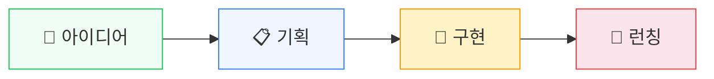

#### ch05 — "외부 서비스 연결"
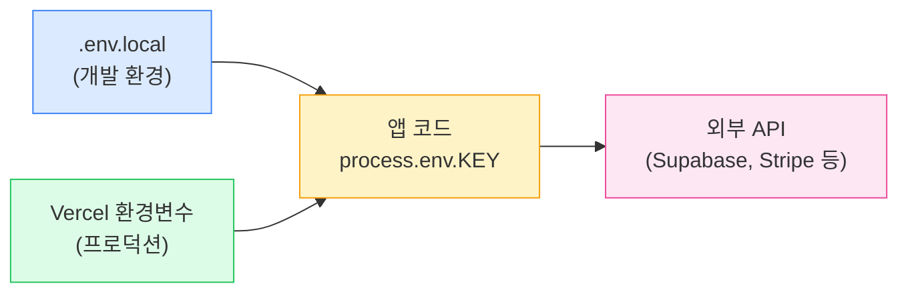

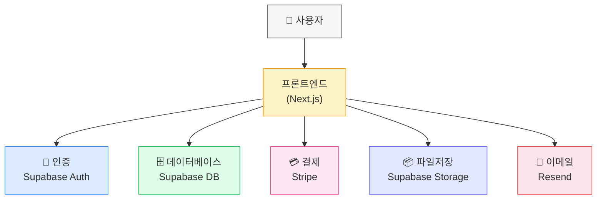

#### ch06 — "아이디어를 명세로"
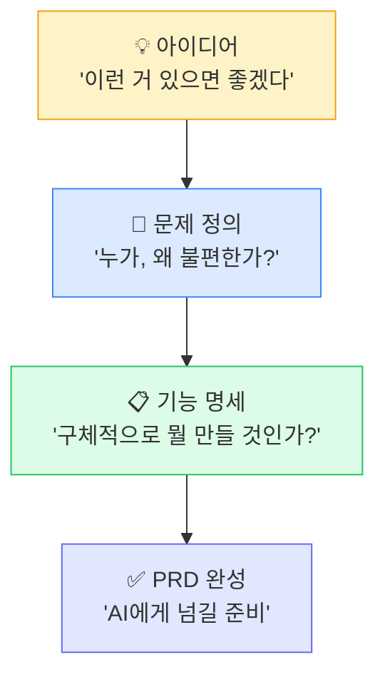

#### ch07 — "MVP: 기능을 깎는 기술"
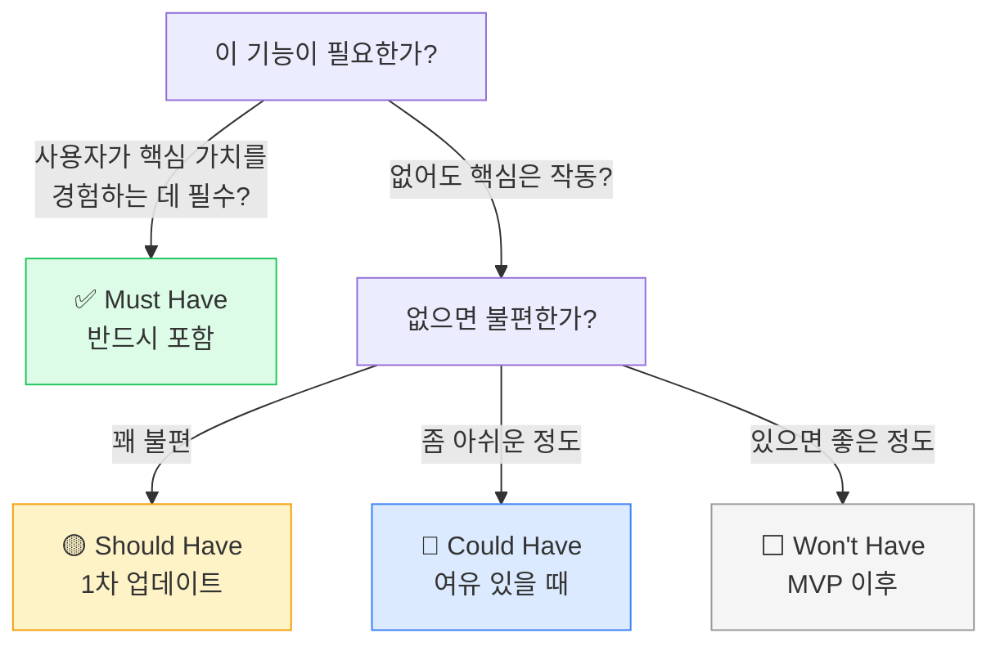

#### ch09 — "도구 생태계"
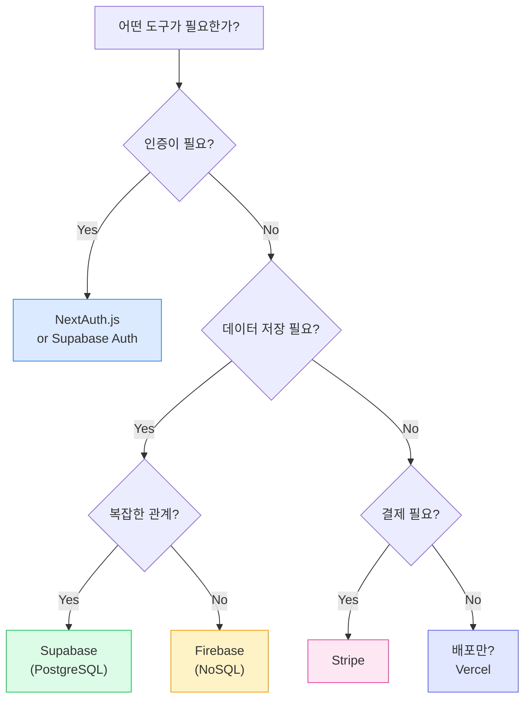

#### ch10 — "AI와 대화하는 법"
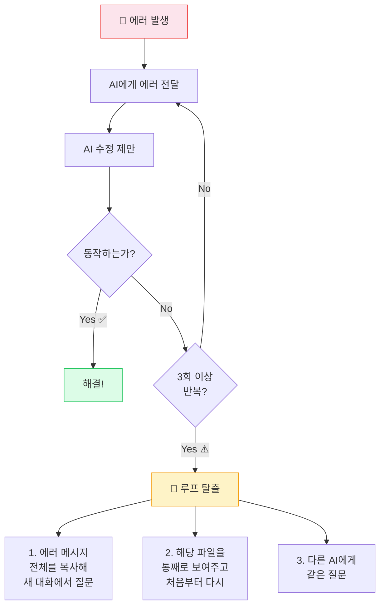

#### ch11 — "기술 부채"
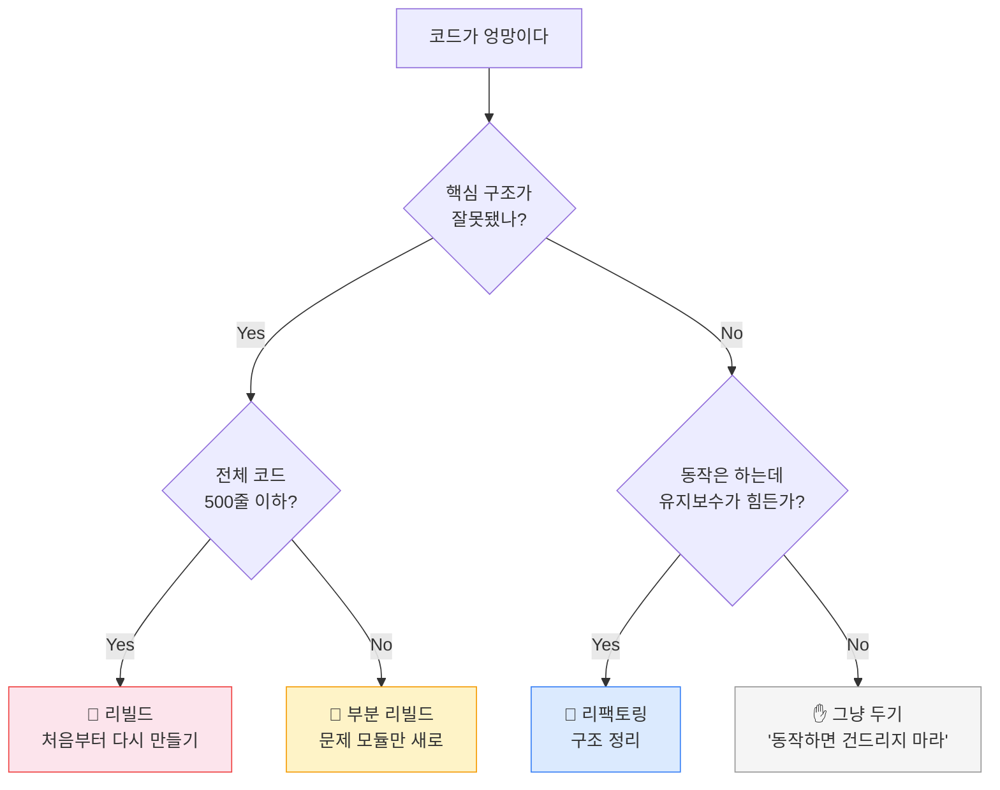

#### ch13 — "빌드"
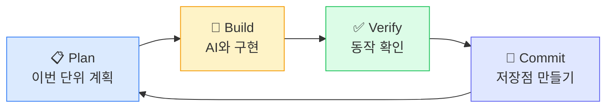

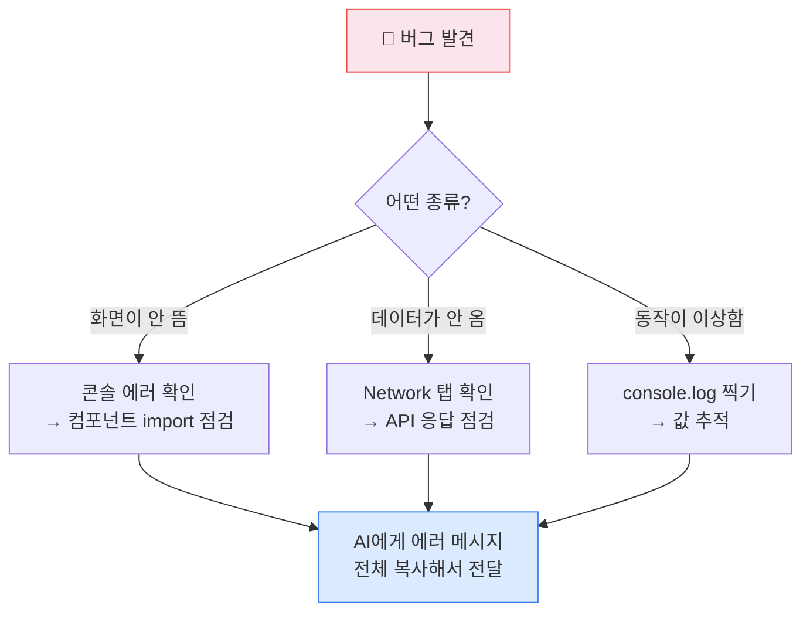

#### ch14 — "배포와 런칭"
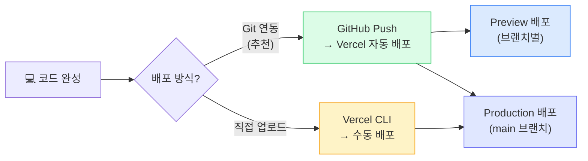

#### ch15 — "이터레이션"
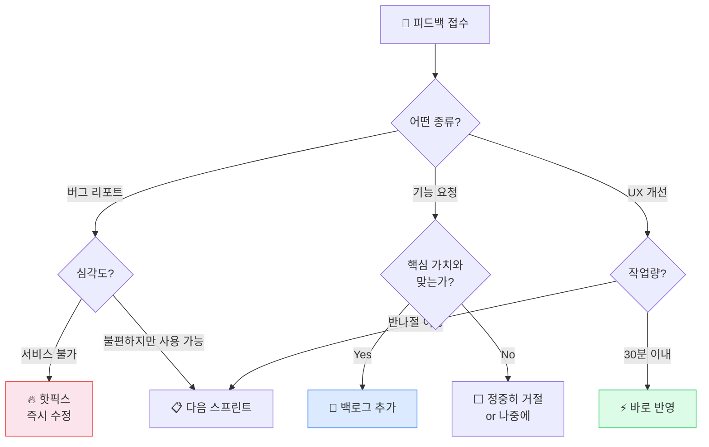

---

## 5. Phase 1C — 컴포넌트 삽입 + 콘텐츠 첨삭 지침

### 삽입 원칙

1. **4~5 스크롤마다 인지 채널 전환** — 연속 텍스트 블록이 4~5 스크롤 이상 이어지면 컴포넌트를 삽입
2. **비유 ↔ 비주얼 연결** — 원고에 비유가 나오면 관련 Mermaid/컴포넌트를 붙인다
3. **프로세스 = StepByStep** — 단계적 설명은 텍스트 대신 StepByStep으로 표현
4. **비교 = TwoColumn 또는 BeforeAfterCompare** — A vs B 구조는 컴포넌트로
5. **옵션 나열 = Tabs** — 3개 이상 병렬 옵션은 Tabs로 전환
6. **텍스트 첨삭 허용** — 컴포넌트로 표현하면 주변 텍스트를 줄이거나 재구성 가능

### 챕터별 주요 삽입 포인트

| 챕터 | Mermaid | 신규 컴포넌트 |
|------|---------|-------------|
| ch00 | 4단계 여정 | — |
| ch01 | (기존) | StepByStep(5요소 각인), TwoColumn(보이는것 vs 숨겨진것) |
| ch02 | (기존) | — |
| ch03 | (기존) | Tabs(SQL vs NoSQL) |
| ch04 | (기존) | — |
| ch05 | 환경변수 흐름 + 아키텍처 | Tabs(서비스별 비교) |
| ch06 | PRD 4단계 | StepByStep(PRD 작성), BeforeAfterCompare(나쁜 vs 좋은 기획) |
| ch07 | MVP 깎기 트리 | TwoColumn(MVP Do vs Don't) |
| ch08 | — | StepByStep(배포 과정) |
| ch09 | 도구 선택 트리 | Tabs(도구 비교) |
| ch10 | AI 에러 루프 | BeforeAfterCompare(프롬프트 전후), TwoColumn(A씨 vs B씨) |
| ch11 | 리빌드/리팩토링 | — |
| ch12 | — | StepByStep(프로젝트 계획 과정) |
| ch13 | 빌드 루프 + 디버깅 | StepByStep(빌드 단위 흐름) |
| ch14 | 배포 경로 | StepByStep(배포 체크리스트) |
| ch15 | 피드백 분류 | — |

---

## 6. 구현 순서 및 의존관계

```
Phase 1A (컴포넌트 구현)  ──────────────────────
  1. StepByStep.tsx + Step       ← 의존 없음
  2. Tabs.tsx + Tab              ← 의존 없음
  3. TwoColumn.tsx + Left/Right  ← 의존 없음
  4. Figure.tsx                  ← 의존 없음
  5. BeforeAfterCompare.tsx + Before/After ← 의존 없음
  6. mdxComponents.ts 등록       ← 1~5 완료 후
  7. index.ts re-export          ← 6 완료 후

Phase 1B (Mermaid 추가)  ─────────────────────── (1A와 병렬 가능)
  각 챕터 MDX에 ```mermaid 코드블록 삽입

Phase 1C (콘텐츠 삽입 + 첨삭)  ──────────────── (1A + 1B 완료 후)
  챕터별로 신규 컴포넌트 + Mermaid를 MDX 본문에 배치
```

**1A의 컴포넌트 5개는 모두 독립적** → 서브에이전트 병렬 구현 가능
**1B는 1A와 독립적** → 1A 컴포넌트 등록 전에도 Mermaid는 기존 컴포넌트로 작동

---

## 7. 파일 변경 범위 요약

### 신규 생성
| 파일 | 유형 |
|------|------|
| `components/mdx/StepByStep.tsx` | 서버 컴포넌트 |
| `components/mdx/Tabs.tsx` | 클라이언트 컴포넌트 |
| `components/mdx/TwoColumn.tsx` | 서버 컴포넌트 |
| `components/mdx/Figure.tsx` | 서버 컴포넌트 |
| `components/mdx/BeforeAfterCompare.tsx` | 서버 컴포넌트 |

### 수정
| 파일 | 변경 내용 |
|------|----------|
| `components/mdx/mdxComponents.ts` | 5개 컴포넌트 + 서브 컴포넌트 import 및 매핑 추가 |
| `components/mdx/index.ts` | re-export 추가 |
| `content/chapters/ch00~ch15.mdx` (16개) | Mermaid 코드블록 + 컴포넌트 삽입 |

### 변경하지 않는 파일
| 파일 | 이유 |
|------|------|
| `lib/mdx.ts` | Mermaid 전처리기 변경 불필요 (기존 그대로 동작) |
| `package.json` | 추가 의존성 없음 |
| `tailwind` 설정 | Tailwind 4는 CSS-first, 설정 파일 불필요 |
| 기존 컴포넌트 6종 | Phase 1에서는 기존 컴포넌트 수정 안 함 |
